---
## Front matter
lang: ru-RU
title: Презентация по лабораторной работе №1
subtitle: Операционные системы
author:
  - Серёгина И.А.
institute:
  - Российский университет дружбы народов, Москва, Россия
date: 18 февраля 2023

## i18n babel
babel-lang: russian
babel-otherlangs: english

## Formatting pdf
toc: false
toc-title: Содержание
slide_level: 2
aspectratio: 169
section-titles: true
theme: metropolis
header-includes:
 - \metroset{progressbar=frametitle,sectionpage=progressbar,numbering=fraction}
 - '\makeatletter'
 - '\beamer@ignorenonframefalse'
 - '\makeatother'
---

## Цели 

Целью данной работы является приобретение практических навыков установки операционной системы на виртуальную машину, настройки минимально необходимых для дальнейшей работы сервисов.

## Задание
1.Установка виртуальной машины
2.Установка ОС
3.Обновление пакетов,и установка драйверов
4.Установка ПО для создания документации
5.Выполение дополнительных заданий

## Проделанная работа
Я уже установила и настроила виртуальную машину в прошлом семестре, установила на неё ПО, необходимое для создания документации, поэтому я пропускаю эти шаги.

## Выполнение лабораторной работы

В прошлом семестре я уже установла и настроила виртуальную машину, установила ОС и ПО для создания документации, так что эти пункты в данной лабораторной работе я пропущу.

## Работа после установки

Я устанавливаю обновления все пакетов (рис. 1).

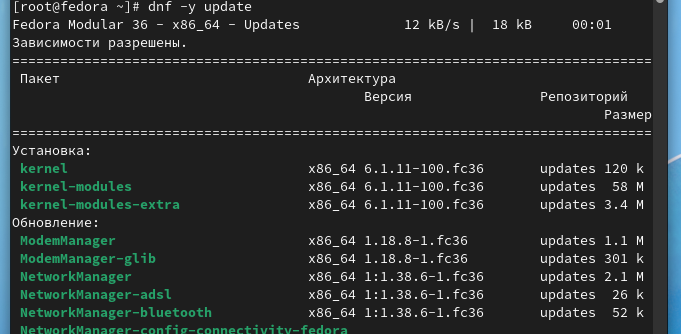{#fig:001 width=70%}

## Работа после установки 

а перед этим перехожу на роль супер-пользователя (рис. 2).

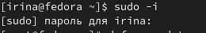{#fig:002 width=70%}

## Работа после установки

После этого устанавливаю tmux, mc для более комфортной работы с терминалом (рис. 3).

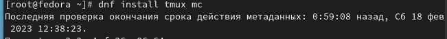{#fig:003 width=70%}

## Работа после установки

Затем с помощью mc перемещаюсь в нужный файл и меняю код, для отключения системы безопасности SELinux.
В файле /etc/selinux/config заменяю значение SELINUX=enforcing на значение SELINUX=permissive (рис. 4).

{#fig:004 width=70%}

## Работа после установки

Перезагружаю виртуальную машину (рис. 5).

{#fig:005 width=70%}

## Работа после установки

После этого запускаю терминальный мультиплексор, перехожу в роль супер-пользователя, устанавливаю пакет dkms (рис. 6).

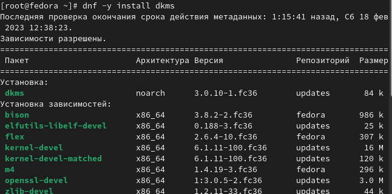{#fig:006 width=70%}

## Работа после установки

Подключаю образ диска гостевой ОС (рис. 7).

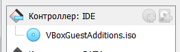{#fig:007 width=70%}

## Работа после установки

С помощью mount примонтировала диск (рис. 8).

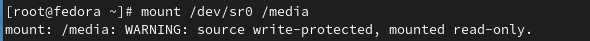{#fig:008 width=70%}

## Работа после установки

Устанавливаю необходимые драйвера (рис. 9).

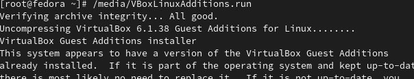{#fig:009 width=70%}

## Работа после установки

После этого перезагружаю виртуальную машину и приступаю к выполнению дополнительного задания

## Выполнение дополнительного задания

С помощью команды dmesg | grep -i "то, что ищем" я нахожу 

Версию ядра Linux (Linux version) (рис. 10).

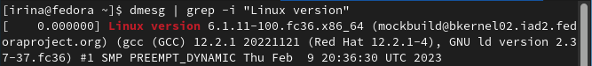{#fig:010 width=70%}

## Выполнение дополнительного задания

Частоту процессора (Mhz processor) (рис. 11).

{#fig:011 width=70%}

## Выполнение дополнительного задания

Модель процессора (CPU0) (рис. 12).

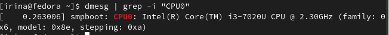{#fig:012 width=70%}

## Выполнение дополнительного задания

Объём доступной оперативной памяти (Memory available) (рис. 13).

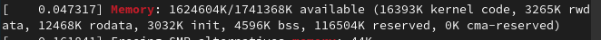{#fig:013 width=70%}

## Выполнение дополнительного задания

Тип обнаруженного гипервизора (Hypervisor detected) (рис. 14).

{#fig:014 width=70%}

## Выполнение дополнительного задания

Тип файловой системы корневого раздела я нахожу с помощью sudo fdisk -l (рис. 15).

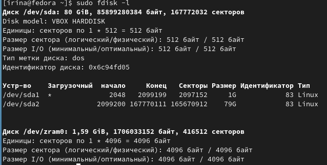{#fig:015 width=70%}

## Выполнение дополнительного задания

Последовательность монтирования файловых систем я нахожу с помощью первой комнады по поиску слова mount (рис. 16).

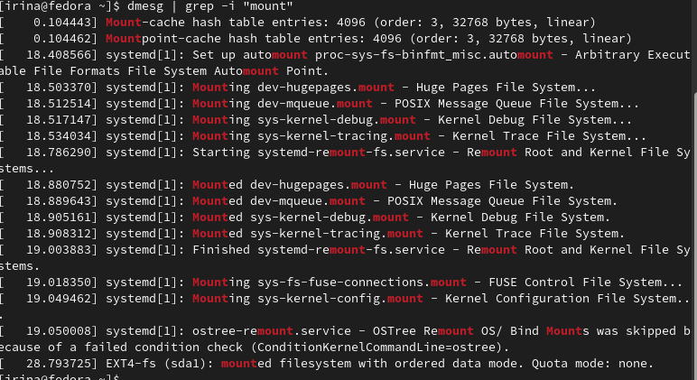{#fig:016 width=70%}

## Выводы

Я приобрела практические навыки установки операционной системы на виртуальную машину, настройки минимально необходимых для дальнейшей работы сервисов.

## Список литературы{.unnumbered}

::: {#refs}
:::
