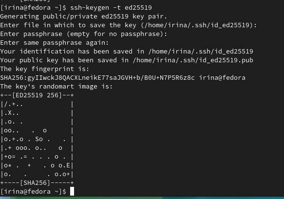
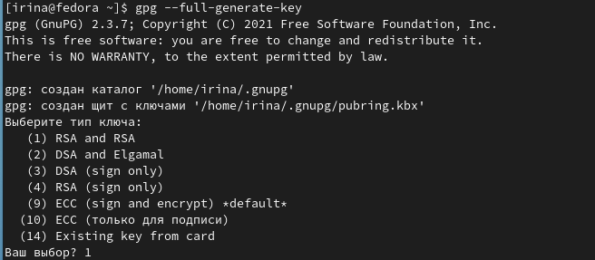
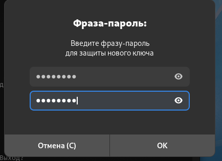
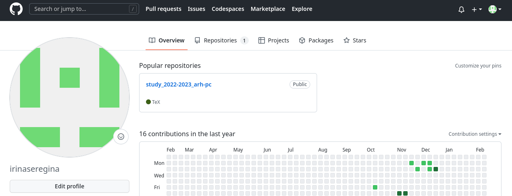
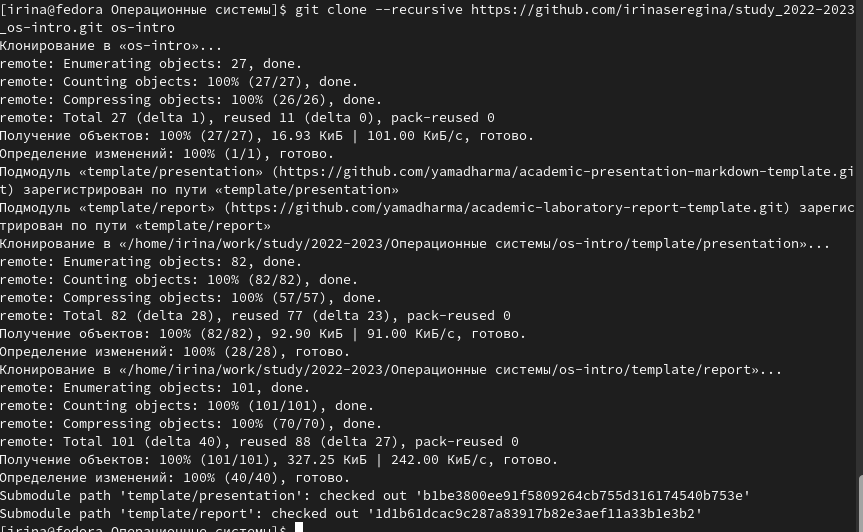
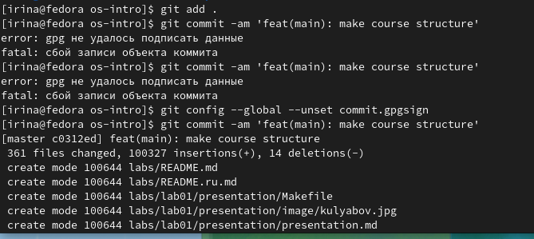

---
## Front matter
title: "Отчёт по лабораторной работе №2"
subtitle: "Операционные системы"
author: "Серёгина Ирина Андреевна"

## Generic otions
lang: ru-RU
toc-title: "Содержание"

## Bibliography
bibliography: bib/cite.bib
csl: pandoc/csl/gost-r-7-0-5-2008-numeric.csl

## Pdf output format
toc: true # Table of contents
toc-depth: 2
lof: true # List of figures
lot: true # List of tables
fontsize: 12pt
linestretch: 1.5
papersize: a4
documentclass: scrreprt
## I18n polyglossia
polyglossia-lang:
  name: russian
  options:
	- spelling=modern
	- babelshorthands=true
polyglossia-otherlangs:
  name: english
## I18n babel
babel-lang: russian
babel-otherlangs: english
## Fonts
mainfont: PT Serif
romanfont: PT Serif
sansfont: PT Sans
monofont: PT Mono
mainfontoptions: Ligatures=TeX
romanfontoptions: Ligatures=TeX
sansfontoptions: Ligatures=TeX,Scale=MatchLowercase
monofontoptions: Scale=MatchLowercase,Scale=0.9
## Biblatex
biblatex: true
biblio-style: "gost-numeric"
biblatexoptions:
  - parentracker=true
  - backend=biber
  - hyperref=auto
  - language=auto
  - autolang=other*
  - citestyle=gost-numeric
## Pandoc-crossref LaTeX customization
figureTitle: "Рис."
tableTitle: "Таблица"
listingTitle: "Листинг"
lofTitle: "Список иллюстраций"
lotTitle: "Список таблиц"
lolTitle: "Листинги"
## Misc options
indent: true
header-includes:
  - \usepackage{indentfirst}
  - \usepackage{float} # keep figures where there are in the text
  - \floatplacement{figure}{H} # keep figures where there are in the text
---

# Цель работы

Цель работы заключается в изучении идеологии и применении средств контроля версий, освоении умения по работе с git.

#Задания 
1.Установка ПО
2.Базовая настройка git
3.Создание ssh-ключа
4.Создание pgp-ключа
5.Регистрация на github
6.Добавление gpg-ключа
7.Настройка автоматических подписей коммитов git
8.Настройка gh
9.Создание репозитория курса на основе шаблона
10.Настройка каталога курса

# Выполнение лабораторной работы

## Установка ПО

Я захожу в роль супер-пользователя и устанавливаю git, gh (рис. @fig:001).

{#fig:001 width=70%}

## Базовая настройка git

Задаю имя и электронную почту владельца репозитория (рис. @fig:002).

{#fig:002 width=70%}

Настраиваю utf-8 в выводе сообщений git (рис. @fig:003).

{#fig:003 width=70%}

Задаю имя начальной ветки master (рис. @fig:004).

{#fig:004 width=70%}

Задаю параметры autocrlf, safecrlf (рис. @fig:005).

{#fig:005 width=70%}

## Создание ssh-ключа

Создаю ключ по алгоритму rsa с ключем размером 4096 бит (рис. @fig:006).

{#fig:006 width=70%}

Создаю ключ по алгоритму ed25519 (рис. @fig:007).

{#fig:007 width=70%}

## Создание pgp-ключа

Генерирую pgp-ключ, из опций выбираю те, которые были представлены в инструкции по лабораторной работе (рис. @fig:008).

{#fig:008 width=70%}

Защищаю ключ с помощью пароля (рис. @fig:009).

{#fig:009 width=70%}

## Регистрация на github

В прошлом семестре я уже создала аккаунт на github, поэтому регистрация не требуется (рис. @fig:010).

{#fig:010 width=70%}

## Добавление gpg-ключа

Вывожу список ключей и копирую отпечаток приватного ключа (рис. @fig:011).

{#fig:011 width=70%}

Копирую мой ключ в буфер обмена с помощью xclip (рис. @fig:012).

{#fig:012 width=70%}

Перехожу на сайт и добавляю новый ключ, куда вставляю его из буфера обмена (рис. @fig:013).

{#fig:013 width=70%}

## Настройка автоматических подписей коммитов git

Настраиваю коммиты так, чтобы при их подписи использовалась моя почта (рис. @fig:014).

{#fig:014 width=70%}

## Настройка gh

Я авторизируюсь, отвечая на насколько вопросов, после этого выбираю продолжить авторизацию в браузере (рис. @fig:015).

{#fig:015 width=70%}

Авторизация прошла успешно (рис. @fig:016).

{#fig:016 width=70%}

## Создание репозитория курса на основе шаблона

Создаю каталог курса с помощью mkdir, после этого перехожу в каталог курса и создаю репозиторий на основе шаблона (рис. @fig:017).

{#fig:017 width=70%}

Затем клонирую репозиторий себе в директорию (рис. @fig:018).

{#fig:018 width=70%}

## Настройка каталога курса

Перехожу в каталог курса, смотрю содержимое с помощью ls (рис. @fig:019).

{#fig:019 width=70%}

Удаляю лишние файлы с помощью rm package.json, проверяю, удалились ли они (рис. @fig:020).

{#fig:020 width=70%}

Создаю необходимые каталоги (рис. @fig:021).

{#fig:021 width=70%}

С помощью git add ., git commit добавляю файлы, которые нужно отправить, и добавляю комментарии к ним (рис. @fig:022).

{#fig:022 width=70%}

С помощью git push отправляю данные на сервер (рис. @fig:023).

{#fig:023 width=70%}

# Ответы на контрольные вопросы

1. VCS - системы контроля версий, ПО, облегчающее работу с изменяемой информацией, которое позволяет одновременно хранить несколько версий одного элемента, рабоать над информацией совместно и отслеживать чужие поправки.
2. Хранилище - часть, в которой хранятся версии информации и данные о её изменении, коммит - фиксатор изменений, позволяющий их отслеживать, история - то, что позволяет вернуться к более ранней версии данных, хранит историю изменений,
рабочая копия - в основном последняя копия документа, основанная на копии из хранилища.
3. Централизованные VCS отличаются от децентрализованных тем, что у них единый общий репозиторий, из которого каждый пользователь может брать информацию, а у децентрализованных каждый имеет свою версию репозитория, имея возможность брать данные из репозиториев других пользователей. К первым относится TFS, ко вторым - Git.
4. Создание и подключение репозитория, а затем постепенная отпрака данных на сервер.
5. Для начала мы берем изначальную версию данных, а после изменения загружаем на сервер новую версию, при этом старая версия не удаляется с сервера.
6. Обеспечение удобной совместной работы и постоянного доступа к данным о состоянии и изменениях в данных.
7. git init - создание основного дерева репозитория
git pull - обновление текущего дерева из центрального репозитория
git push - отправка изменений локального дерева на сервер
git status - просмотр списка измененных файлов в текущей директории
git diff - просмотр текущих изменений
gt add . - добавление созданных и измененных файлов и каталогов
git commit -m "" - сохранение добавленных изменений с комментарием
git checkout -b "" - создание ветки с именем
git branch -d "" - удвление ветки с именем
8. При использовании команды git pull мы загружаем информацию из удаленного репозитория и обновляем локальный.
9. Ветвление означает создание параллельных веток для более удобной совместной работы над проектом, грубо говоря это история изменений. Изначально существует одна главная ветка.
10.Не все файлы требуют добавления в репозиторий, они могут просто быть бесполезными, поэтому с помощью .gitignore их можно проигнорировать при добавлении информации на сервер.

# Выводы

Я изучила идеологию и применение средств контроля версий, освоила умения по работе с git.

# Список литературы{.unnumbered}

::: {#refs}
:::
