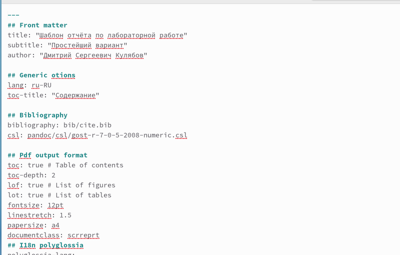
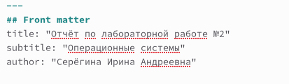
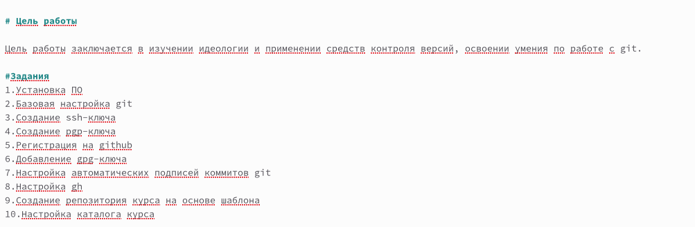
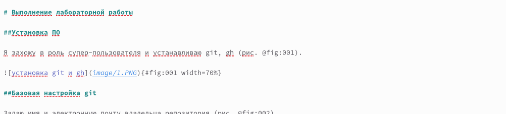
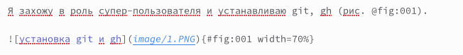
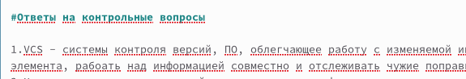
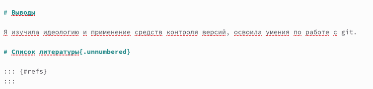

---
## Front matter
lang: ru-RU
title: Лабораторная работа №3
subtitle: Операционные системы
author:
  - Серёгина Ирина Андреевна
institute:
  - Российский университет дружбы народов, Москва, Россия
date: 24 февраля 2023

## i18n babel
babel-lang: russian
babel-otherlangs: english

## Formatting pdf
toc: false
toc-title: Содержание
slide_level: 2
aspectratio: 169
section-titles: true
theme: metropolis
header-includes:
 - \metroset{progressbar=frametitle,sectionpage=progressbar,numbering=fraction}
 - '\makeatletter'
 - '\beamer@ignorenonframefalse'
 - '\makeatother'
---
## Цель работы

Научиться оформлять отчёты с помощью легковесного языка разметки Markdown.

## Теоретическое введение

- для создания заголовка можно воспользоваться символом #
- для полужирного начертания нужно заключить текст в двойные звездочки **-**
- для курсивного начертания достаточно одинарных звездочек *-*
- для курсива и жирного шрифта используются тройные звездочки ***-***

## Теоретическое введение

- С помощью символа >создаются блоки цитирования
- С помощью цифр или же тире можно создавать списки, а для создания подпунктов нужно добавить отступ
- С помощью комбинации текста гиперссылки в квадратных скобках и URL-адреса в круглых скобках создаются ссылки
- Также есть возможность добавить индексы и формулы с помощью спец. знаков

## Теоретическое введение
Согласно ГОСТ7.32-2001 каждый отчет должен включать в себя следующие части:
- титульный лист
- реферат
- введение
- основную часть
- заключение
Также приветствуются такие элементы: список исполнителей, содержание, нормативные ссылки,определения, обозначения и сокращения, список источников, приложения.

## Выполнение лабораторной работы.

Для оформления отчёта я пользуюсь предоставленным шаблоном (рис. 1).

{#fig:001 width=70%}

## Выполнение лабораторной работы. Титульный лист

В начале шаблона есть часть, необходимая для оформления титульного листа (рис. 2).

{#fig:002 width=70%}

## Выполнение лабораторной работы. Заполнение шаблона отчёта

Для начала я прописываю цели своей работы, а затем списком выписываю задания, которые мне нужно сделать (рис. 3).

{#fig:003 width=70%}

## Выполнение лабораторной работы. Заполнение шаблона отчёта

Затем я приступаю к описанию хода работы, записывая загловок с одним знаком "#", а подзаголовок - с двумя (рис. 4).

{#fig:004 width=70%}

## Выполнение лабораторной работы. Заполнение шаблона отчёта

Подписываю и прикрепляю иллюстрации с помощью специальной конструкции (рис. 5).

{#fig:005 width=70%}

## Выполнение лабораторной работы. Заполнение шаблона отчёта

После этого я отвечаю на контрольные вопросы, ответы оформляю списком (рис. 6).

{#fig:006 width=70%}

## Выполнение лабораторной работы. Заполнение шаблона отчёта

Затем я прописываю выводы, соответсвующие цели работы, добавляю, но не заполняю список литературы (рис. 7).

{#fig:007 width=70%}

## Выводы

Я научилась оформлять отчёты с помощью легковесного языка разметки Markdown.

## Заключительный слайд

Спасибо за внимание!!

:::

