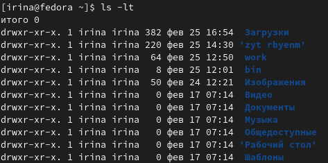

---
## Front matter
lang: ru-RU
title: Лабораторная работа №4
subtitle: Операционные системы
author:
  - Серёгина Ирина Андреевна
institute:
  - Российский университет дружбы народов, Москва, Россия
date: 03 марта 2023

## i18n babel
babel-lang: russian
babel-otherlangs: english

## Formatting pdf
toc: false
toc-title: Содержание
slide_level: 2
aspectratio: 169
section-titles: true
theme: metropolis
header-includes:
 - \metroset{progressbar=frametitle,sectionpage=progressbar,numbering=fraction}
 - '\makeatletter'
 - '\beamer@ignorenonframefalse'
 - '\makeatother'
---

# Цель работы

Приобретение практических навыков взаимодействия пользователя с системой по-
средством командной строки.

# Задание 

1.Определите полное имя вашего домашнего каталога. Далее относительно этого ката-
лога будут выполняться последующие упражнения.
2.Выполните следующие действия:
2.1. Перейдите в каталог /tmp.
2.2. Выведите на экран содержимое каталога /tmp. Для этого используйте команду ls
с различными опциями. Поясните разницу в выводимой на экран информации.
2.3. Определите, есть ли в каталоге /var/spool подкаталог с именем cron?
2.4. Перейдите в Ваш домашний каталог и выведите на экран его содержимое. Опре-
делите, кто является владельцем файлов и подкаталогов?
3.Выполните следующие действия:
3.1. В домашнем каталоге создайте новый каталог с именем newdir.
3.2. В каталоге ~/newdir создайте новый каталог с именем morefun.
3.3. В домашнем каталоге создайте одной командой три новых каталога с именами
letters, memos, misk. Затем удалите эти каталоги одной командой.
3.4. Попробуйте удалить ранее созданный каталог ~/newdir командой rm. Проверьте,
был ли каталог удалён.
3.5. Удалите каталог ~/newdir/morefun из домашнего каталога. Проверьте, был ли
каталог удалён.
4.С помощью команды man определите, какую опцию команды ls нужно использо-
вать для просмотра содержимое не только указанного каталога, но и подкаталогов,
входящих в него.
5.С помощью команды man определите набор опций команды ls, позволяющий отсорти-
ровать по времени последнего изменения выводимый список содержимого каталога
с развёрнутым описанием файлов.
6.Используйте команду man для просмотра описания следующих команд: cd, pwd, mkdir,
rmdir, rm. Поясните основные опции этих команд.
7.Используя информацию, полученную при помощи команды history, выполните мо-
дификацию и исполнение нескольких команд из буфера команд.

# Выполнение лабораторной работы

Открываю терминал, с помощью pwd определяю имя домашего каталога (рис. 1).

{#fig:001 width=70%}

# Выполнение лабораторной работы

Перехожу в каталог /tmp (рис. 2).

{#fig:002 width=70%}

# Выполнение лабораторной работы

С помощью ls просматриваю содержимое (рис. 3).

{#fig:003 width=70%}

# Выполнение лабораторной работы

Поле этого для просмотра содержимого использую ls -la, разница в том, что вторая выводит всю информацию об имеющихся файлах (рис. 4).

{#fig:004 width=70%}

# Выполнение лабораторной работы

С помощью cd и ls определяю, есть ли в каталоге /var/spool файл cron. Такого файла нет (рис. 5).

{#fig:005 width=70%}

# Выполнение лабораторной работы

После этого перехожу в домашний каталог и проверяю, кто является владельцем файлов и подкаталогов (рис. 6).

{#fig:006 width=70%}

# Выполнение лабораторной работы

Создаю новый каталог с именем newdir, а в нем новый каталог с именем morefun (рис. 7).

{#fig:007 width=70%}

# Выполнение лабораторной работы

В каталоге morefun создаю три других, а потом удаляю их одной командой (рис. 8).

{#fig:008 width=70%}

# Выполнение лабораторной работы

Командой rm каталог не удаляется. поэтому я удаляю один, а затем - другой с помощью rmdir (рис. 9).

{#fig:009 width=70%}

# Выполнение лабораторной работы

С помощью команды man узнаю необходимую информацию про команду ls (рис. 10).

{#fig:010 width=70%}

# Выполнение лабораторной работы

Для просмотра содержимое не только указанного каталога, но и подкаталогов,
входящих в него нужно использовать ls -a (рис. 11).

{#fig:011 width=70%}

# Выполнение лабораторной работы

Отсортировать по времени последнего изменения выводимый список содержимого каталога
с развёрнутым описанием файлов дает ls -lt (рис. 12).

{#fig:012 width=70%}

# Выполнение лабораторной работы

С помощью man просматриваю описание cd, ее соновная функция - переносить в необходимый каталог (рис. 13).

{#fig:013 width=70%}

# Выполнение лабораторной работы

С помощью man просматриваю описание pwd, ее основная функция - показывать имя рабочего каталога (рис. 14).

{#fig:014 width=70%}

# Выполнение лабораторной работы

С помощью man просматриваю описание mkdir, ее основная функция - создавать новые каталоги (рис. 15).

{#fig:015 width=70%}

# Выполнение лабораторной работы

С помощью man просматриваю описание rmdir, ее основная функция - удалять определенные пустые каталоги (рис. 16).

{#fig:016 width=70%}

# Выполнение лабораторной работы

С помощью man просматриваю описание rm, ее основная функция - удалять выбранные файлы (рис. 17).

{#fig:017 width=70%}

# Выполнение лабораторной работы

Используя информацию, полученную при помощи команды history, выполняю мо-
дификацию и исполнение нескольких команд из буфера команд (рис.18).

{#fig:018 width=70%}

# Выводы

Я приобрела практические навыки взаимодействия пользователя с системой посредством командной строки.

:::

