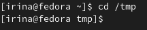

---
## Front matter
title: "Лабораторная работа №4"
subtitle: "Операционные системы"
author: "Серёгина Ирина Андреевна"

## Generic otions
lang: ru-RU
toc-title: "Содержание"

## Bibliography
bibliography: bib/cite.bib
csl: pandoc/csl/gost-r-7-0-5-2008-numeric.csl

## Pdf output format
toc: true # Table of contents
toc-depth: 2
lof: true # List of figures
lot: true # List of tables
fontsize: 12pt
linestretch: 1.5
papersize: a4
documentclass: scrreprt
## I18n polyglossia
polyglossia-lang:
  name: russian
  options:
	- spelling=modern
	- babelshorthands=true
polyglossia-otherlangs:
  name: english
## I18n babel
babel-lang: russian
babel-otherlangs: english
## Fonts
mainfont: PT Serif
romanfont: PT Serif
sansfont: PT Sans
monofont: PT Mono
mainfontoptions: Ligatures=TeX
romanfontoptions: Ligatures=TeX
sansfontoptions: Ligatures=TeX,Scale=MatchLowercase
monofontoptions: Scale=MatchLowercase,Scale=0.9
## Biblatex
biblatex: true
biblio-style: "gost-numeric"
biblatexoptions:
  - parentracker=true
  - backend=biber
  - hyperref=auto
  - language=auto
  - autolang=other*
  - citestyle=gost-numeric
## Pandoc-crossref LaTeX customization
figureTitle: "Рис."
tableTitle: "Таблица"
listingTitle: "Листинг"
lofTitle: "Список иллюстраций"
lotTitle: "Список таблиц"
lolTitle: "Листинги"
## Misc options
indent: true
header-includes:
  - \usepackage{indentfirst}
  - \usepackage{float} # keep figures where there are in the text
  - \floatplacement{figure}{H} # keep figures where there are in the text
---

# Цель работы

Приобретение практических навыков взаимодействия пользователя с системой по-
средством командной строки.

# Задание 

1.Определите полное имя вашего домашнего каталога. Далее относительно этого ката-
лога будут выполняться последующие упражнения.
2.Выполните следующие действия:
2.1. Перейдите в каталог /tmp.
2.2. Выведите на экран содержимое каталога /tmp. Для этого используйте команду ls
с различными опциями. Поясните разницу в выводимой на экран информации.
2.3. Определите, есть ли в каталоге /var/spool подкаталог с именем cron?
2.4. Перейдите в Ваш домашний каталог и выведите на экран его содержимое. Опре-
делите, кто является владельцем файлов и подкаталогов?
3.Выполните следующие действия:
3.1. В домашнем каталоге создайте новый каталог с именем newdir.
3.2. В каталоге ~/newdir создайте новый каталог с именем morefun.
3.3. В домашнем каталоге создайте одной командой три новых каталога с именами
letters, memos, misk. Затем удалите эти каталоги одной командой.
3.4. Попробуйте удалить ранее созданный каталог ~/newdir командой rm. Проверьте,
был ли каталог удалён.
3.5. Удалите каталог ~/newdir/morefun из домашнего каталога. Проверьте, был ли
каталог удалён.
4.С помощью команды man определите, какую опцию команды ls нужно использо-
вать для просмотра содержимое не только указанного каталога, но и подкаталогов,
входящих в него.
5.С помощью команды man определите набор опций команды ls, позволяющий отсорти-
ровать по времени последнего изменения выводимый список содержимого каталога
с развёрнутым описанием файлов.
6.Используйте команду man для просмотра описания следующих команд: cd, pwd, mkdir,
rmdir, rm. Поясните основные опции этих команд.
7.Используя информацию, полученную при помощи команды history, выполните мо-
дификацию и исполнение нескольких команд из буфера команд.

# Выполнение лабораторной работы

Открываю терминал, с помощью pwd определяю имя домашего каталога (рис. @fig:001).

{#fig:001 width=70%}

Перехожу в каталог /tmp (рис. @fig:002).

{#fig:002 width=70%}

С помощью ls просматриваю содержимое (рис. @fig:003).

{#fig:003 width=70%}

Поле этого для просмотра содержимого использую ls -la, разница в том, что вторая выводит всю информацию об имеющихся файлах (рис. @fig:004).

{#fig:004 width=70%}

С помощью cd и ls определяю, есть ли в каталоге /var/spool файл cron. Такого файла нет (рис. @fig:005).

{#fig:005 width=70%}

После этого перехожу в домашний каталог и проверяю, кто является владельцем файлов и подкаталогов (рис. @fig:006).

{#fig:006 width=70%}

Создаю новый каталог с именем newdir, а в нем новый каталог с именем morefun (рис. @fig:007).

{#fig:007 width=70%}

В каталоге morefun создаю три других, а потом удаляю их одной командой (рис. @fig:008).

{#fig:008 width=70%}

Командой rm каталог не удаляется. поэтому я удаляю один, а затем - другой с помощью rmdir (рис. @fig:009).

{#fig:009 width=70%}

С помощью команды man узнаю необходимую информацию про команду ls (рис. @fig:010).

{#fig:010 width=70%}

Для просмотра содержимое не только указанного каталога, но и подкаталогов,
входящих в него нужно использовать ls -a (рис. @fig:011).

{#fig:011 width=70%}

Отсортировать по времени последнего изменения выводимый список содержимого каталога
с развёрнутым описанием файлов дает ls -lt (рис. @fig:012).

{#fig:012 width=70%}

С помощью man просматриваю описание cd, ее соновная функция - переносить в необходимый каталог (рис. @fig:013).

{#fig:013 width=70%}

С помощью man просматриваю описание pwd, ее основная функция - показывать имя рабочего каталога (рис. @fig:014).

{#fig:014 width=70%}

С помощью man просматриваю описание mkdir, ее основная функция - создавать новые каталоги (рис. @fig:015).

{#fig:015 width=70%}

С помощью man просматриваю описание rmdir, ее основная функция - удалять определенные пустые каталоги (рис. @fig:016).

{#fig:016 width=70%}

С помощью man просматриваю описание rm, ее основная функция - удалять выбранные файлы (рис. @fig:017).

{#fig:017 width=70%}

Используя информацию, полученную при помощи команды history, выполняю мо-
дификацию и исполнение нескольких команд из буфера команд (рис. @fig:018).

{#fig:018 width=70%}

# Ответы на контрольные вопросы 

1.Командная строка - программа, с помощью которой с импользованием различных команд, можно управлять компьютером.
2.Аюсолютный путь текущего каталога можно определить с помощью pwd.
3.С помощью команды ls можно получить информацию о типе и имени файлов в текущем каталоге.
4.Информацию о скрытых файлах можно отобразить с помощью ls -a, например увидеть файлы, имя которых начинается с точки.
5.Для удаления файл можно использовать команду rm, а для удаления пустого каталога можно использовать команду rmdir, если же нужно удалить каталог именно первым способом, то нужно использовать rm -r.
6.Историю исполненных команд можно просмотреть с помощью команды history.
7.Модифицировать команду можно с помощью конструкции   ! "номер команды":s/"что меняем"/"на что меняем" , например: !3:s/a/F  ls -F.
8.Чтобы одновременно перейти в домашнюю директорию и посмотреть ее содержимое нужно через точку с запятой записать команды cd и ls.
9.Символ экранирования - обратный слэш, который позволяет использовать спец символ без изменений. Также он позволяет считывать пробелы в названии каталога, например cd /home/кухонные задания
10.Эта опция дает доступ к врмени создания файла. имени создателя.
11.Относительный путь начинается в каталоге, в котром вы находитесь, а абсолютный путь идет из корневого каталога.
12.Информацию о команде можно получить с помощью команд help, man.
13.tab

# Выводы

Я приобрела практические навыки взаимодействия пользователя с системой посредством командной строки.

# Список литературы{.unnumbered}

::: {#refs}
:::
