---
## Front matter
lang: ru-RU
title: Лабораторная работа №5
subtitle: Операционные системы
author:
  - Серёгина Ирина Андреевна
institute:
  - Российский университет дружбы народов, Москва, Россия
  
date: 11 марта 2023

## i18n babel
babel-lang: russian
babel-otherlangs: english

## Formatting pdf
toc: false
toc-title: Содержание
slide_level: 2
aspectratio: 169
section-titles: true
theme: metropolis
header-includes:
 - \metroset{progressbar=frametitle,sectionpage=progressbar,numbering=fraction}
 - '\makeatletter'
 - '\beamer@ignorenonframefalse'
 - '\makeatother'
---

# Цель работы

Ознакомление с файловой системой Linux, её структурой, именами и содержанием каталогов. Приобретение практических навыков по применению команд для работы с файлами и каталогами, по управлению процессами (и работами),
по проверке использования диска и обслуживанию файловой системы. 

# Задание

1. Выполнить команды, показанные в примерах 
2. Поработать с перемещением и переименовыванием файлов 
3. Поработать с правами доступа
4. Прочитать информацию про определенные команды 
5. Контрольные вопросы

# Выполнение лабораторной работы

## Выполнение лабораторной работы

Создаю файл и два раза копирую его с разными именами (рис. 1).

{#fig:001 width=70%}

## Выполнение лабораторной работы

Создаю каталог, а затем копирую туда созданные ранее файлы (рис. 2).

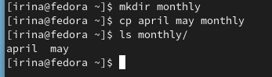{#fig:002 width=70%}

## Выполнение лабораторной работы

Копирую файлы, находящиеся не в текущем каталоге (рис. 3).

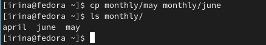{#fig:003 width=70%}

## Выполнение лабораторной работы

Создаю новый каталог и копирую предыдущий каталог, затем проверяю корректность выполнения (рис. 4).

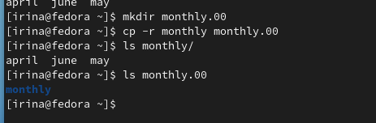{#fig:004 width=70%}

## Выполнение лабораторной работы

Новый каталог копирую в /tmp (рис. 5).

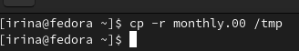{#fig:005 width=70%}

## Выполнение лабораторной работы

Переименовываю файлы и пермещаю их в другой каталог (рис. 6).

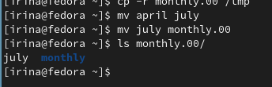{#fig:006 width=70%}

## Выполнение лабораторной работы

Переименовываю и перемещаю каталоги (рис. 7).

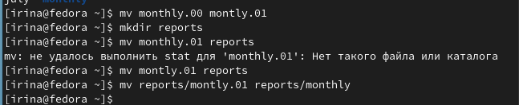{#fig:007 width=70%}

## Выполнение лабораторной работы

Создаю файл, добавляю права владельца на выполнение, а потом убираю их (рис. 8).

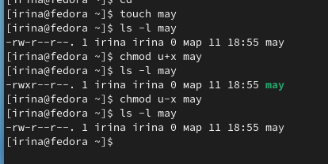{#fig:008 width=70%}

## Выполнение лабораторной работы

Создаю каталог с запретом на чтение для членов группы и остальных пользователей (рис. 9).

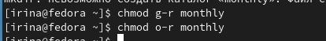{#fig:009 width=70%}

## Выполнение лабораторной работы

Создаю файл с правом записи для членов группы (рис. 10).

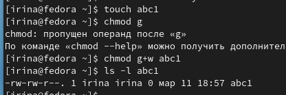{#fig:010 width=70%}

## Выполнение лабораторной работы

Проверяю файловую систему (рис. 11).

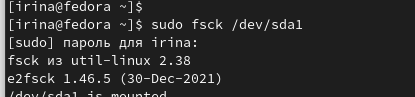{#fig:011 width=70%}

## Выполнение лабораторной работы

Копирую в домашний каталог файл с изменением инмени, а затем копирую этот файл в новую директорию, опять меняю имя (рис. 12).

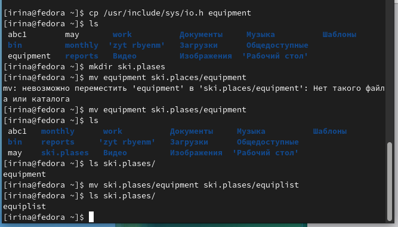{#fig:012 width=70%}

## Выполнение лабораторной работы

Создаю еще один файл, копирую в новый каталог, меняю имя (рис. 13).

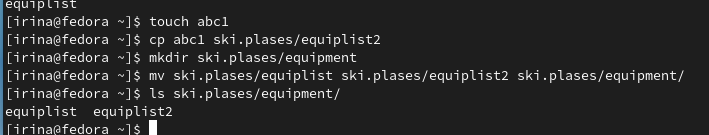{#fig:013 width=70%}

## Выполнение лабораторной работы

Создаю директорию, перемещаю в созданный до этого каталог (рис. 14).

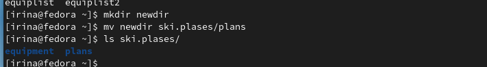{#fig:014 width=70%}

## Выполнение лабораторной работы

Создаю каталог, меняю права так, чтобы они совпадали с заданными (рис. 15).

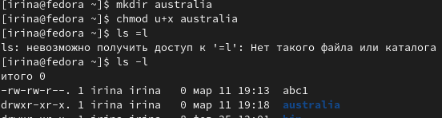{#fig:015 width=70%}

## Выполнение лабораторной работы

Создаю каталог, меняю права так, чтобы они совпадали с заданными (рис. 16).

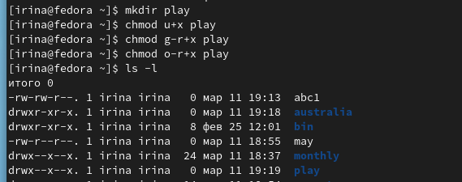{#fig:016 width=70%}

## Выполнение лабораторной работы

Создаю каталог, меняю права так, чтобы они совпадали с заданными (рис. 17).

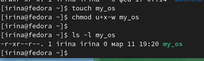{#fig:017 width=70%}

## Выполнение лабораторной работы

Создаю каталог, меняю права так, чтобы они совпадали с заданными (рис. 18).

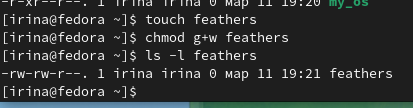{#fig:018 width=70%}

## Выполнение лабораторной работы

Читаю содержимое файла (рис. 19).

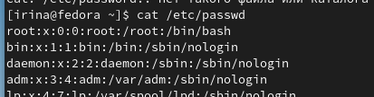{#fig:019 width=70%}

## Выполнение лабораторной работы

Копирую файл с изменением имени в каталог, который затем копирую с изменением имени, копирую в него папку (рис. 20).

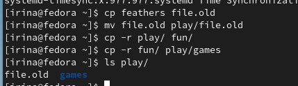{#fig:020 width=70%}

## Выполнение лабораторной работы

Убираю права на чтение для владельца, поэтому не могу ни прочитать, ни скопировать файл, после проверки возвращаю права (рис. 21).

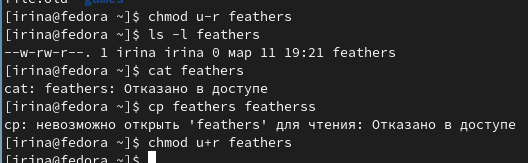{#fig:021 width=70%}

## Выполнение лабораторной работы

Удаляю у каталога права на выполнение для владельца, поэтому перейти в него не получается, возвращаю права (рис. 22).

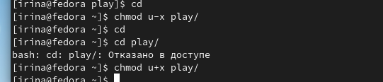{#fig:022 width=70%}

## Выполнение лабораторной работы

Просматриваю информацию по командам (рис. 23).

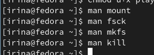{#fig:023 width=70%}

mount - используется для монтирования файловых систем, fsck - нужна для того, чтобы проверять согласованность файловых систем, mkfs - нужна, чтобы создавать файловые системы, kill - посылает определенный сигнал к заданному процессу.

# Выводы

Я ознакомилась с файловой системой Linux, её структурой, именами и содержанием каталогов, приобрела практические навыки по применению команд для работы с файлами и каталогами, по управлению процессами (и работами),
по проверке использования диска и обслуживанию файловой системы.

