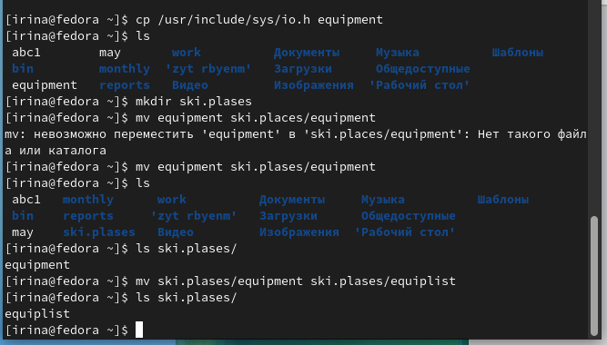

---
## Front matter
title: "Лабораторная работа №5"
subtitle: "Операционные системы"
author: "Серёгина Ирина Андреевна"

## Generic otions
lang: ru-RU
toc-title: "Содержание"

## Bibliography
bibliography: bib/cite.bib
csl: pandoc/csl/gost-r-7-0-5-2008-numeric.csl

## Pdf output format
toc: true # Table of contents
toc-depth: 2
lof: true # List of figures
lot: true # List of tables
fontsize: 12pt
linestretch: 1.5
papersize: a4
documentclass: scrreprt
## I18n polyglossia
polyglossia-lang:
  name: russian
  options:
	- spelling=modern
	- babelshorthands=true
polyglossia-otherlangs:
  name: english
## I18n babel
babel-lang: russian
babel-otherlangs: english
## Fonts
mainfont: PT Serif
romanfont: PT Serif
sansfont: PT Sans
monofont: PT Mono
mainfontoptions: Ligatures=TeX
romanfontoptions: Ligatures=TeX
sansfontoptions: Ligatures=TeX,Scale=MatchLowercase
monofontoptions: Scale=MatchLowercase,Scale=0.9
## Biblatex
biblatex: true
biblio-style: "gost-numeric"
biblatexoptions:
  - parentracker=true
  - backend=biber
  - hyperref=auto
  - language=auto
  - autolang=other*
  - citestyle=gost-numeric
## Pandoc-crossref LaTeX customization
figureTitle: "Рис."
tableTitle: "Таблица"
listingTitle: "Листинг"
lofTitle: "Список иллюстраций"
lotTitle: "Список таблиц"
lolTitle: "Листинги"
## Misc options
indent: true
header-includes:
  - \usepackage{indentfirst}
  - \usepackage{float} # keep figures where there are in the text
  - \floatplacement{figure}{H} # keep figures where there are in the text
---

# Цель работы

Ознакомление с файловой системой Linux, её структурой, именами и содержанием каталогов. Приобретение практических навыков по применению команд для работы с файлами и каталогами, по управлению процессами (и работами),
по проверке использования диска и обслуживанию файловой системы. 

# Задание

1. Выполнить команды, показанные в примерах 
2. Поработать с перемещением и переименовыванием файлов 
3. Поработать с правами доступа
4. Прочитать информацию про определенные команды 
5. Контрольные вопросы

# Выполнение лабораторной работы

Создаю файл и два раза копирую его с разными именами (рис. @fig:001).

{#fig:001 width=70%}

Создаю каталог, а затем копирую туда созданные ранее файлы (рис. @fig:002).

{#fig:002 width=70%}

Копирую файлы, находящиеся не в текущем каталоге (рис. @fig:003).

{#fig:003 width=70%}

Создаю новый каталог и копирую предыдущий каталог, затем проверяю корректность выполнения (рис. @fig:004).

{#fig:004 width=70%}

Новый каталог копирую в /tmp (рис. @fig:005).

{#fig:005 width=70%}

Переименовываю файлы и пермещаю их в другой каталог (рис. @fig:006).

{#fig:006 width=70%}

Переименовываю и перемещаю каталоги (рис. @fig:007).

{#fig:007 width=70%}

Создаю файл, добавляю права владельца на выполнение, а потом убираю их (рис. @fig:008).

{#fig:008 width=70%}

Создаю каталог с запретом на чтение для членов группы и остальных пользователей (рис. @fig:009).

{#fig:009 width=70%}

Создаю файл с правом записи для членов группы (рис. @fig:010).

{#fig:010 width=70%}

Проверяю файловую систему (рис. @fig:011).

{#fig:011 width=70%}

Копирую в домашний каталог файл с изменением инмени, а затем копирую этот файл в новую директорию, опять меняю имя (рис. @fig:012).

{#fig:012 width=70%}

Создаю еще один файл, копирую в новый каталог, меняю имя (рис. @fig:013).

{#fig:013 width=70%}

Создаю директорию, перемещаю в созданный до этого каталог (рис. @fig:014).

{#fig:014 width=70%}

Создаю каталог, меняю права так, чтобы они совпадали с заданными (рис. @fig:015).

{#fig:015 width=70%}

Создаю каталог, меняю права так, чтобы они совпадали с заданными (рис. @fig:016).

{#fig:016 width=70%}

Создаю каталог, меняю права так, чтобы они совпадали с заданными (рис. @fig:017).

{#fig:017 width=70%}

Создаю каталог, меняю права так, чтобы они совпадали с заданными (рис. @fig:018).

{#fig:018 width=70%}

Читаю содержимое файла (рис. @fig:019).

{#fig:019 width=70%}

Копирую файл с изменением имени в каталог, который затем копирую с изменением имени, копирую в него папку (рис. @fig:020).

{#fig:020 width=70%}

Убираю права на чтение для владельца, поэтому не могу ни прочитать, ни скопировать файл, после проверки возвращаю права (рис. @fig:021).

{#fig:021 width=70%}

Удаляю у каталога права на выполнение для владельца, поэтому перейти в него не получается, возвращаю права (рис. @fig:022).

{#fig:022 width=70%}

Просматриваю информацию по командам (рис. @fig:023).

{#fig:023 width=70%}

mount - используется для монтирования файловых систем, fsck - нужна для того, чтобы проверять согласованность файловых систем, mkfs - нужна, чтобы создавать файловые системы, kill - посылает определенный сигнал к заданному процессу.

# Выводы

Я ознакомилась с файловой системой Linux, её структурой, именами и содержанием каталогов, приобрела практические навыки по применению команд для работы с файлами и каталогами, по управлению процессами (и работами),
по проверке использования диска и обслуживанию файловой системы. 

# Список литературы{.unnumbered}

::: {#refs}
:::
