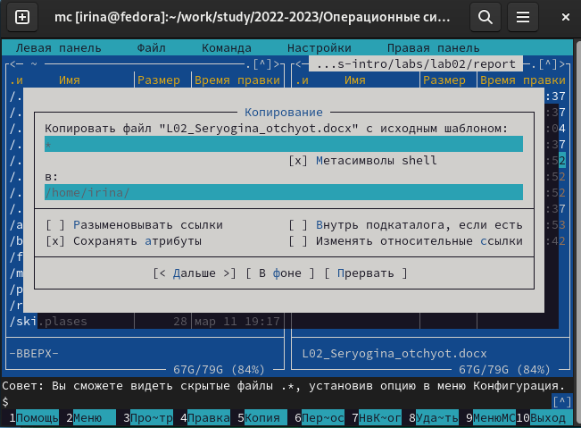
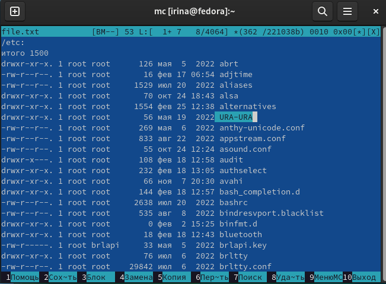
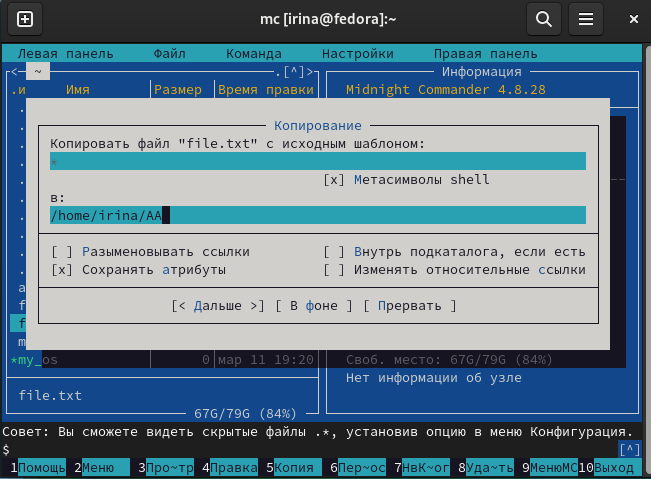
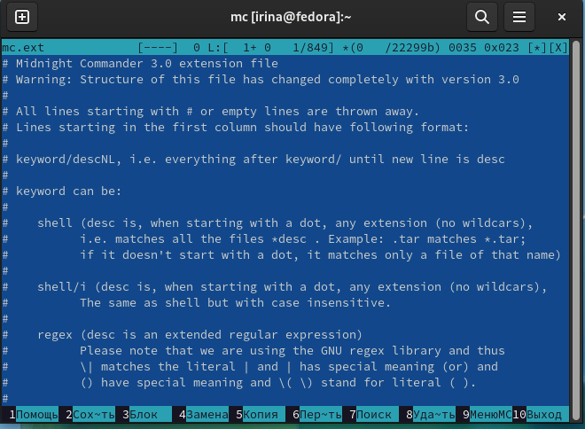
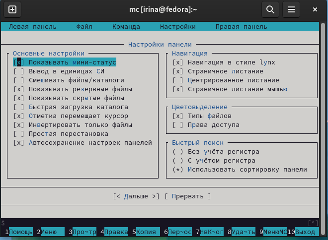
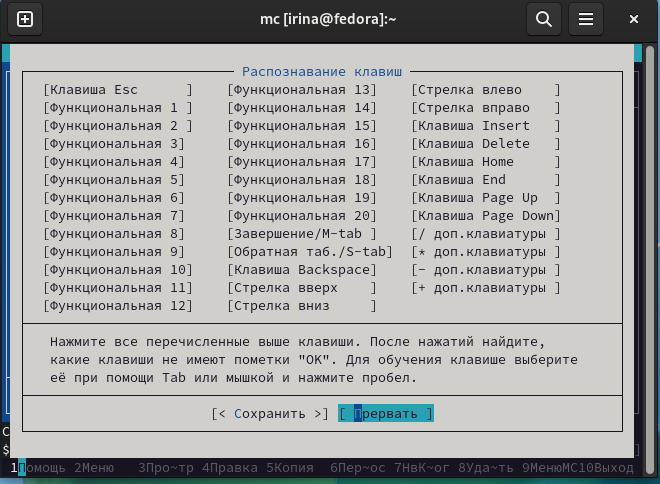
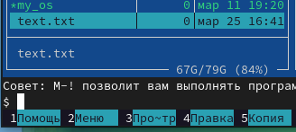
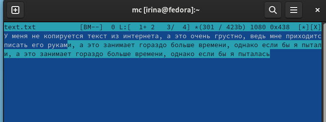
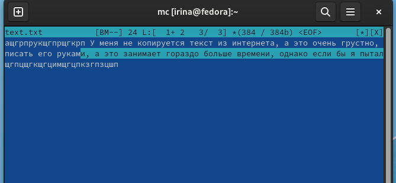
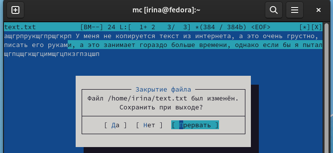

---
## Front matter
lang: ru-RU
title: Лабораторная работа №7
subtitle: Операционнные системы
author:
  - Серёгина Ирина Андреевна
institute:
  - Российский университет дружбы народов, Москва, Россия
  
date: 25 марта 2023

## i18n babel
babel-lang: russian
babel-otherlangs: english

## Formatting pdf
toc: false
toc-title: Содержание
slide_level: 2
aspectratio: 169
section-titles: true
theme: metropolis
header-includes:
 - \metroset{progressbar=frametitle,sectionpage=progressbar,numbering=fraction}
 - '\makeatletter'
 - '\beamer@ignorenonframefalse'
 - '\makeatother'
---

# Цель работы

Освоение основных возможностей командной оболочки Midnight Commander. Приоб-
ретение навыков практической работы по просмотру каталогов и файлов; манипуляций
с ними.

# Задание

## Задание по mc
1. Изучите информацию о mc, вызвав в командной строке man mc.
2. Запустите из командной строки mc, изучите его структуру и меню.
3. Выполните несколько операций в mc, используя управляющие клавиши (операции
с панелями; выделение/отмена выделения файлов, копирование/перемещение фай-
лов, получение информации о размере и правах доступа на файлы и/или каталоги
и т.п.)
4. Выполните основные команды меню левой (или правой) панели. Оцените степень
подробности вывода информации о файлах.
5. Используя возможности подменю Файл , выполните:
– просмотр содержимого текстового файла;
– редактирование содержимого текстового файла (без сохранения результатов
редактирования);
– создание каталога;
– копирование в файлов в созданный каталог.
6. С помощью соответствующих средств подменю Команда осуществите:
– поиск в файловой системе файла с заданными условиями (например, файла
с расширением .c или .cpp, содержащего строку main);
– выбор и повторение одной из предыдущих команд;
– переход в домашний каталог;
– анализ файла меню и файла расширений.
7. Вызовите подменю Настройки . Освойте операции, определяющие структуру экрана mc
(Full screen, Double Width, Show Hidden Files и т.д.)ю

## Задание по встроенному редактору mc
1. Создайте текстовой файл text.txt.
2. Откройте этот файл с помощью встроенного в mc редактора.
3. Вставьте в открытый файл небольшой фрагмент текста, скопированный из любого
другого файла или Интернета.
4. Проделайте с текстом следующие манипуляции, используя горячие клавиши:
4.1. Удалите строку текста.
4.2. Выделите фрагмент текста и скопируйте его на новую строку.
Кулябов Д. С. и др. Операционные системы 69
4.3. Выделите фрагмент текста и перенесите его на новую строку.
4.4. Сохраните файл.
4.5. Отмените последнее действие.
4.6. Перейдите в конец файла (нажав комбинацию клавиш) и напишите некоторый
текст.
4.7. Перейдите в начало файла (нажав комбинацию клавиш) и напишите некоторый
текст.
4.8. Сохраните и закройте файл.
5. Откройте файл с исходным текстом на некотором языке программирования (напри-
мер C или Java)
6. Используя меню редактора, включите подсветку синтаксиса, если она не включена,
или выключите, если она включена.

# Теоретическое введение

Командная оболочка — интерфейс взаимодействия пользователя с операционной систе-
мой и программным обеспечением посредством команд.
Midnight Commander (или mc) — псевдографическая командная оболочка для UNIX/Linux
систем. Для запуска mc необходимо в командной строке набрать mc и нажать Enter .
Рабочее пространство mc имеет две панели, отображающие по умолчанию списки
файлов двух каталогов

# Выполнение лабораторной работы

## Выполнение лабораторной работы

Используя man mc, читаю информацию о команде (рис. 1).

{#fig:001 width=70%}

## Выполнение лабораторной работы

Открываю mc (рис. 2).

{#fig:002 width=70%}

## Выполнение лабораторной работы

С помощью F5 я могу создать копию документа (рис. 3).

{#fig:003 width=70%}

## Выполнение лабораторной работы

Могу вывести информацию о файле в правой панели (рис. 4).

{#fig:004 width=70%}

## Выполнение лабораторной работы

Открываю файл для редактирования (рис. 5).

{#fig:005 width=70%}

## Выполнение лабораторной работы

Меняю там одну строчку, потом выхожу, не сохраняя изменения (рис. 6).

{#fig:006 width=70%}

## Выполнение лабораторной работы

Создаю каталог (рис. 7).

{#fig:007 width=70%}

## Выполнение лабораторной работы

Копирую туда файл (рис. 8).

{#fig:008 width=70%}

## Выполнение лабораторной работы

Ищу файл с необходимым содержимым (рис. 9).

{#fig:009 width=70%}

## Выполнение лабораторной работы

Перехожу в домашний каталог (рис. 10).

{#fig:010 width=70%}

## Выполнение лабораторной работы

Выполняю последнюю команду из истории (рис. 11).

{#fig:011 width=70%}

## Выполнение лабораторной работы

Открываю файл расширения (рис. 12).

{#fig:012 width=70%}

## Выполнение лабораторной работы

Открываю файл меню (рис. 13).

{#fig:013 width=70%}

## Выполнение лабораторной работы

Настраиваю панель (рис. 14).

{#fig:014 width=70%}

## Выполнение лабораторной работы

Настраиваю распознавание клавиш (рис. 15).

{#fig:015 width=70%}

## Выполнение лабораторной работы

Настраиваю внешний вид (рис. 16).

{#fig:016 width=70%}

## Выполнение лабораторной работы

Создаю новый файл (рис. 17).

{#fig:017 width=70%}

## Выполнение лабораторной работы

Открываю его и записываю туда текст (рис. 18).

{#fig:018 width=70%}

## Выполнение лабораторной работы

Удаляю строку, пользуясь cntrl+y (рис. 19).

{#fig:019 width=70%}

## Выполнение лабораторной работы

С помощью F3, F6 выделяю и перемщаю текст (рис. 20).

{#fig:020 width=70%}

## Выполнение лабораторной работы

Изменения сохраняю с помощью F2 (рис. 21).

{#fig:021 width=70%}

## Выполнение лабораторной работы

Отменяю последнее действие, пользуясь cntrl+u (рис. 22).

{#fig:022 width=70%}

## Выполнение лабораторной работы

Перемещаюсь в начало и конец текста, добавляю новые фрагменты (рис. 23).

{#fig:023 width=70%}

## Выполнение лабораторной работы

Сохраняю изменения, выхожу (рис. 24).

{#fig:024 width=70%}

# Выводы

Я освоила основные возможности командной оболочки Midnight Commander. Приоб-
рела навыки практической работы по просмотру каталогов и файлов; манипуляций
с ними.
:::

