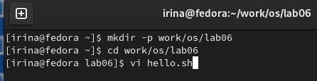
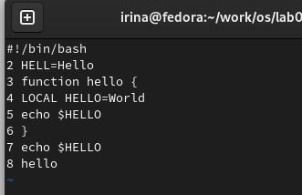
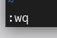
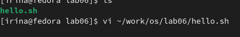
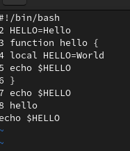
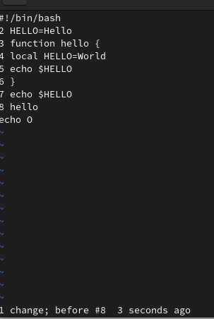

---
## Front matter
lang: ru-RU
title: Лабораторная работа №8
subtitle: Операционнные системы
author:
  - Серёгина Ирина Андреевна
institute:
  - Российский университет дружбы народов, Москва, Россия
 
date: 01 апреля 2023

## i18n babel
babel-lang: russian
babel-otherlangs: english

## Formatting pdf
toc: false
toc-title: Содержание
slide_level: 2
aspectratio: 169
section-titles: true
theme: metropolis
header-includes:
 - \metroset{progressbar=frametitle,sectionpage=progressbar,numbering=fraction}
 - '\makeatletter'
 - '\beamer@ignorenonframefalse'
 - '\makeatother'
---

# Цель работы

Познакомиться с операционной системой Linux. Получить практические навыки рабо-
ты с редактором vi, установленным по умолчанию практически во всех дистрибутивах.

# Выполнение лабораторной работы

## Выполнение лабораторной работы

1.Создаю каталог с именем ~/work/os/lab06, перехожу во вновь созданный каталог, вызываю vi и создаю файл hello.sh (рис. 1).

{#fig:001 width=70%}

## Выполнение лабораторной работы

2.Нажмиаю клавишу i и ввожу данный текст (рис. 2).

{#fig:002 width=70%}

## Выполнение лабораторной работы

3.Нажимаю клавишу Esc для перехода в командный режим после завершения ввода
текста, затем нажимаю : для перехода в режим последней строки, нажимаю w (записать) и q (выйти), а затем нажимаю клавишу Enter для сохранения текста и завершения работы  (рис. 3).

{#fig:003 width=70%}

## Выполнение лабораторной работы
 
4.Делаю файл исполняемым (рис. 4).

{#fig:004 width=70%}

## Выполнение лабораторной работы

5.Вызываю vi на редактирование файла, заьем проделываю все изменения, указанные в инструкции (рис. 5).

{#fig:005 width=70%}

## Выполнение лабораторной работы

6.Отменяю последнюю команду (т.е. удаление строки) (рис. 6).

{#fig:006 width=70%}

## Выполнение лабораторной работы

7.Ввожу символ : для перехода в режим последней строки, записываю произведённые
изменения и выхожу из vi (рис. 7).

{#fig:007 width=70%}

# Выводы

Я познакомилась с операционной системой Linux, получила практические навыки рабо-
ты с редактором vi, установленным по умолчанию практически во всех дистрибутивах.

