---
## Front matter
lang: ru-RU
title: Лабораторная работа №9
subtitle: Операционные системы
author:
  - Серёгина Ирина Андреевна
institute:
  - Российский университет дружбы народов, Москва, Россия
  
date: 06 апреля 2023

## i18n babel
babel-lang: russian
babel-otherlangs: english

## Formatting pdf
toc: false
toc-title: Содержание
slide_level: 2
aspectratio: 169
section-titles: true
theme: metropolis
header-includes:
 - \metroset{progressbar=frametitle,sectionpage=progressbar,numbering=fraction}
 - '\makeatletter'
 - '\beamer@ignorenonframefalse'
 - '\makeatother'
---

# Цель работы

Познакомиться с операционной системой Linux. Получить практические навыки работы с редактором Emacs.

# Задание

## Задание

1. Открыть emacs.
2. Создать файл lab07.sh с помощью комбинации Ctrl-x Ctrl-f (C-x C-f).
3. Написать данную команду
4. Сохранить файл с помощью комбинации Ctrl-x Ctrl-s (C-x C-s).

## Задание

5. Проделать с текстом стандартные процедуры редактирования, каждое действие долж-
но осуществляться комбинацией клавиш.
5.1. Вырезать одной командой целую строку (С-k).
5.2. Вставить эту строку в конец файла (C-y).
5.3. Выделить область текста (C-space).
5.4. Скопировать область в буфер обмена (M-w).
5.5. Вставить область в конец файла.
5.6. Вновь выделить эту область и на этот раз вырезать её (C-w).
5.7. Отмените последнее действие (C-/).

## Задание

6. Научитесь использовать команды по перемещению курсора.
6.1. Переместите курсор в начало строки (C-a).
6.2. Переместите курсор в конец строки (C-e).
6.3. Переместите курсор в начало буфера (M-<).
6.4. Переместите курсор в конец буфера (M->).

## Задание

7. Управление буферами.
7.1. Вывести список активных буферов на экран (C-x C-b).
7.2. Переместитесь во вновь открытое окно (C-x) o со списком открытых буферов
и переключитесь на другой буфер.
7.3. Закройте это окно (C-x 0).
7.4. Теперь вновь переключайтесь между буферами, но уже без вывода их списка на
экран (C-x b).

## Задание

8. Управление окнами.
8.1. Поделите фрейм на 4 части: разделите фрейм на два окна по вертикали (C-x 3),
а затем каждое из этих окон на две части по горизонтали (C-x 2) (см. рис. 9.1).
8.2. В каждом из четырёх созданных окон откройте новый буфер (файл) и введите
несколько строк текста.

## Задание

9. Режим поиска
9.1. Переключитесь в режим поиска (C-s) и найдите несколько слов, присутствующих
в тексте.
9.2. Переключайтесь между результатами поиска, нажимая C-s.
9.3. Выйдите из режима поиска, нажав C-g.
9.4. Перейдите в режим поиска и замены (M-%), введите текст, который следует найти
и заменить, нажмите Enter , затем введите текст для замены. После того как будут
подсвечены результаты поиска, нажмите ! для подтверждения замены.
9.5. Испробуйте другой режим поиска, нажав M-s o. Объясните, чем он отличается от
обычного режима?

# Теоретическое введение

## Теоретическое введение

Определение 1. Буфер — объект, представляющий какой-либо текст.
Буфер может содержать что угодно, например, результаты компиляции программы
или встроенные подсказки. Практически всё взаимодействие с пользователем, в том
числе интерактивное, происходит посредством буферов.
Определение 2. Фрейм соответствует окну в обычном понимании этого слова. Каждый
фрейм содержит область вывода и одно или несколько окон Emacs.

## Теоретическое введение

Определение 3. Окно — прямоугольная область фрейма, отображающая один из буфе-
ров.
Каждое окно имеет свою строку состояния, в которой выводится следующая информа-
ция: название буфера, его основной режим, изменялся ли текст буфера и как далеко вниз
по буферу расположен курсор. Каждый буфер находится только в одном из возможных
основных режимов. Существующие основные режимы включают режим Fundamental
(наименее специализированный), режим Text, режим Lisp, режим С, режим Texinfo
и другие. Под второстепенными режимами понимается список режимов, которые вклю-
чены в данный момент в буфере выбранного окна.

## Теоретическое введение

Определение 4. Область вывода — одна или несколько строк внизу фрейма, в которой
Emacs выводит различные сообщения, а также запрашивает подтверждения и дополни-
тельную информацию от пользователя.
Определение 5. Минибуфер используется для ввода дополнительной информации и все-
гда отображается в области вывода.
Определение 6. Точка вставки — место вставки (удаления) данных в буфере.

# Выполнение лабораторной работы

## Выполнение лабораторной работы

1. Открываю emacs (рис. 1).

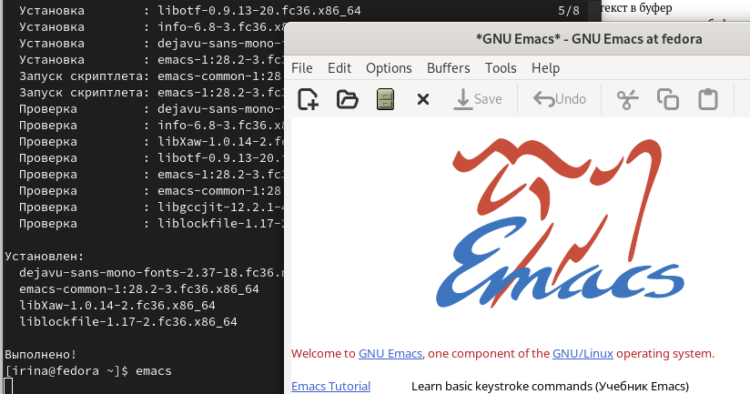{#fig:001 width=70%}

## Выполнение лабораторной работы

2. Создаю файл lab07.sh с помощью комбинации Ctrl-x Ctrl-f (C-x C-f), туда вписываю программу из инструкции, затем сохраняю файл с помощью комбинации Ctrl-x Ctrl-s (C-x C-s) (рис. 2).

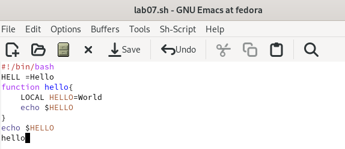{#fig:002 width=70%}

## Выполнение лабораторной работы

3. Вырезаю одной командой целую строку (С-k) (рис. 3).

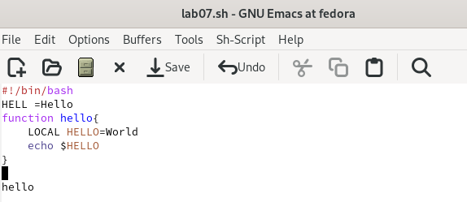{#fig:003 width=70%}

## Выполнение лабораторной работы

4. Вставляю эту строку в конец файла (C-y) (рис. 4).

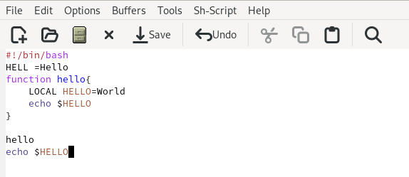{#fig:004 width=70%}

## Выполнение лабораторной работы

5. После этого выполняю дальнейшие необходимые изменения, заканчиваю отменой последнего действия (рис. 5).

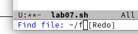{#fig:005 width=70%}

## Выполнение лабораторной работы

6. Перемещаю курсор в начало строки (C-a) (рис. 6).

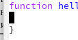{#fig:006 width=70%}

## Выполнение лабораторной работы

7. Перемещаю курсор в конец строки (C-e) (рис. 7).

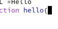{#fig:007 width=70%}

## Выполнение лабораторной работы

8. Перемещаю курсор в начало буфера (M-<) (рис. 8).

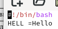{#fig:008 width=70%}

## Выполнение лабораторной работы

9. Перемещаю курсор в конец буфера (M->) (рис. 9).

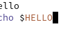{#fig:009 width=70%}

## Выполнение лабораторной работы

10. Премещаюсь на другой буфер (C-x) o (рис. 10).

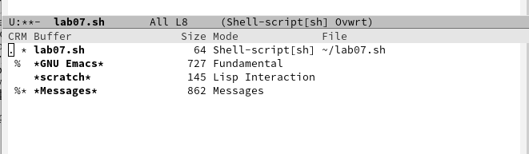{#fig:010 width=70%}

## Выполнение лабораторной работы

11. Делю фрейм на 4 части (рис. 11).

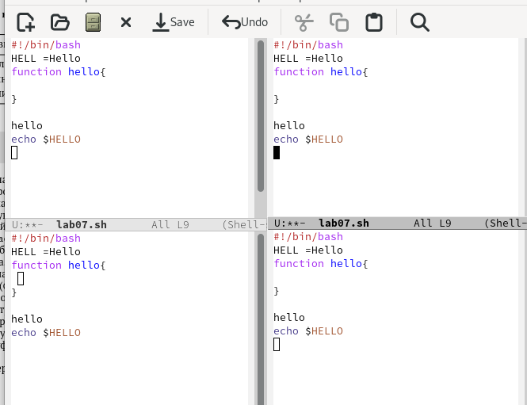{#fig:011 width=70%}

## Выполнение лабораторной работы

12. В каждом из четырёх созданных окон открываю новый буфер  (рис. 12).

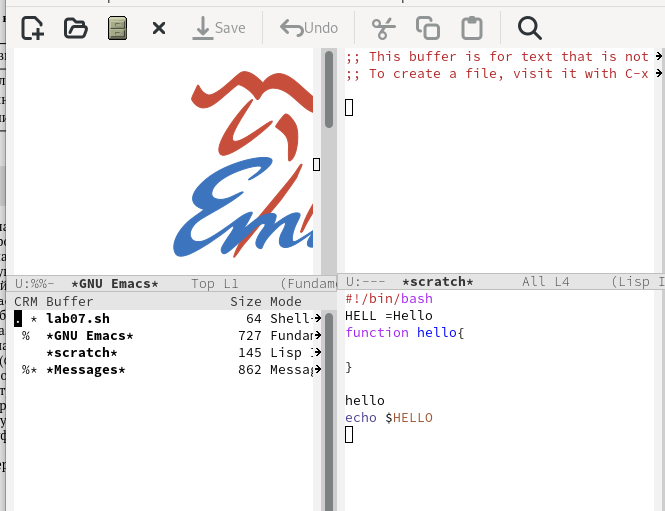{#fig:012 width=70%}

## Выполнение лабораторной работы

13. Переключаюсь в режим поиска (C-s) и нахожу несколько слов, присутствующих
в тексте (рис. 13).

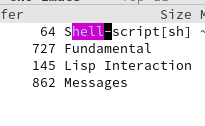{#fig:013 width=70%}

# Выводы

Я познакомилась с операционной системой Linux, получила практические навыки работы с редактором Emacs.

