---
## Front matter
lang: ru-RU
title: Лабораторная работа №13
subtitle: Операционные системы
author:
  - Серёгина Ирина Андреевна
institute:
  - Российский университет дружбы народов, Москва, Россия
  
date: 01.05.2023

## i18n babel
babel-lang: russian
babel-otherlangs: english

## Formatting pdf
toc: false
toc-title: Содержание
slide_level: 2
aspectratio: 169
section-titles: true
theme: metropolis
header-includes:
 - \metroset{progressbar=frametitle,sectionpage=progressbar,numbering=fraction}
 - '\makeatletter'
 - '\beamer@ignorenonframefalse'
 - '\makeatother'
---

# Цель работы

Приобрести простейшие навыки разработки, анализа, тестирования и отладки приложений в ОС типа UNIX/Linux на примере создания на языке программирования С калькулятора с простейшими функциями.

# Задание

1. В домашнем каталоге создайте подкаталог ~/work/os/lab_prog.
2. Создайте в нём файлы: calculate.h, calculate.c, main.c.
3. Выполните компиляцию программы посредством gcc.
4. При необходимости исправьте синтаксические ошибки.
5. Создайте Makefile.
6. С помощью gdb выполните отладку программы calcul (перед использованием gdb
исправьте Makefile).
7. С помощью утилиты splint попробуйте проанализировать коды файлов calculate.c
и main.c.

# Выполнение лабораторной работы

## Выполнение лабораторной работы

1. В домашнем каталоге создаю подкаталог ~/work/os/lab_prog (рис. 1).

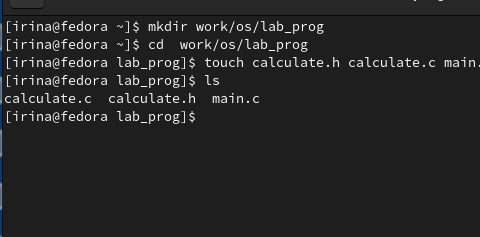{#fig:001 width=70%}

## Выполнение лабораторной работы

2. Создаю в нём файлы: calculate.h, calculate.c, main.c. (рис. 2).

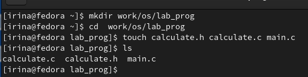{#fig:002 width=70%}

## Выполнение лабораторной работы

3. Реализация функций калькулятора в файле calculate.h (рис. 3).

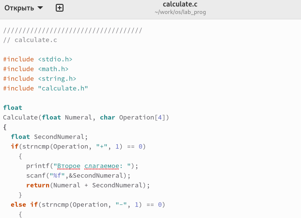{#fig:003 width=70%}

## Выполнение лабораторной работы

4. Интерфейсный файл calculate.h, описывающий формат вызова функции калькулятора (рис. 4).

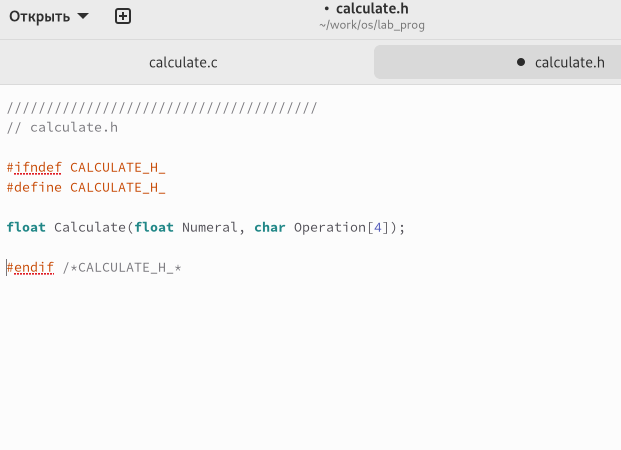{#fig:004 width=70%}

## Выполнение лабораторной работы

5. Основной файл main.c, реализующий интерфейс пользователя к калькулятору (рис. 5).

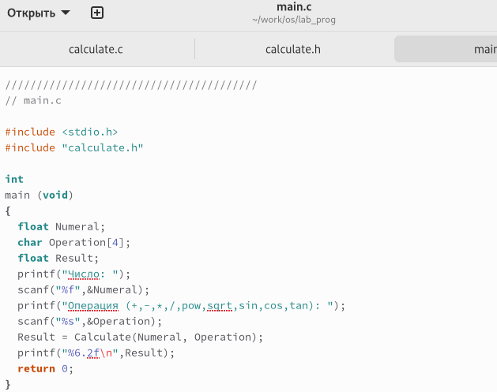{#fig:005 width=70%}

## Выполнение лабораторной работы

6. Выполняю компиляцию программы посредством gcc (рис. 6).

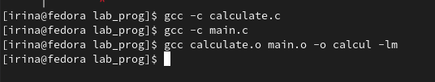{#fig:006 width=70%}

## Выполнение лабораторной работы

7. Создаю Makefile, исправляю ошибки (рис. 7).

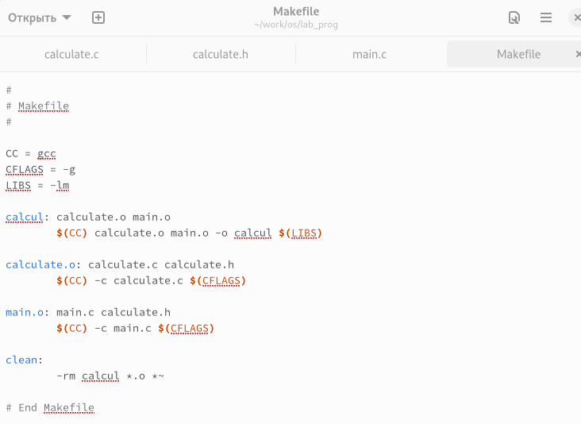{#fig:007 width=70%}

## Выполнение лабораторной работы

8. Выполняю команду make (рис. 8).

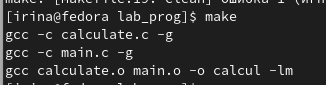{#fig:008 width=70%}

## Выполнение лабораторной работы

9. Запускаю отладчик GDB, загрузив в него программу для отладки (рис. 9).

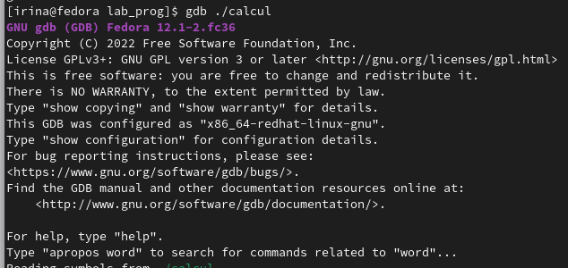{#fig:009 width=70%}

## Выполнение лабораторной работы

10. Для запуска программы внутри отладчика ввожу команду run (рис. 10).

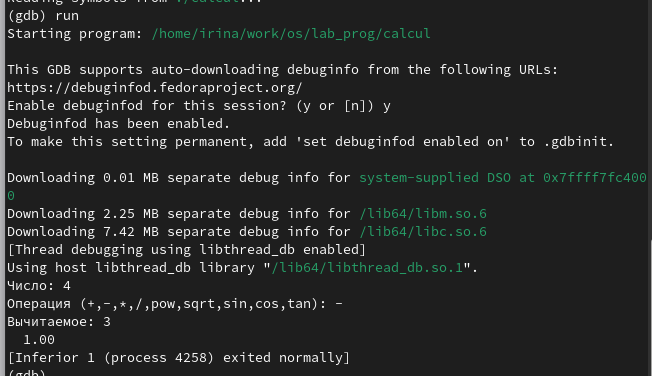{#fig:010 width=70%}

## Выполнение лабораторной работы

11. Для постраничного (по 9 строк) просмотра исходного код использую команду list (рис. 11).

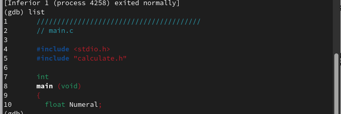{#fig:011 width=70%}

## Выполнение лабораторной работы

12. Для просмотра строк с 12 по 15 основного файла использую команду list(рис. 12).

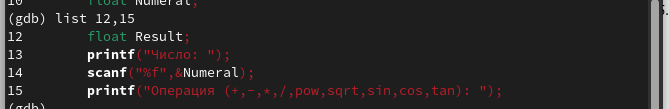{#fig:012 width=70%}

## Выполнение лабораторной работы

13. Для просмотра определённых строк не основного файла использую list с параметрами (рис. 13).

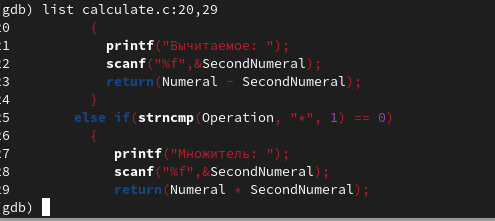{#fig:013 width=70%}

## Выполнение лабораторной работы

14. Устанавливаю точку останова в файле calculate.c на строке номер 21 (рис. 14).

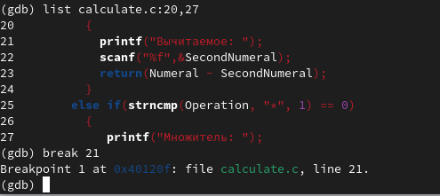{#fig:014 width=70%}

## Выполнение лабораторной работы

15. Вывожу информацию об имеющихся в проекте точках останова (рис. 15).

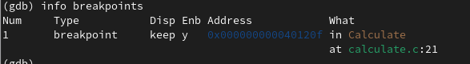{#fig:015 width=70%}

## Выполнение лабораторной работы

16. Запускаю программу внутри отладчика и убеждаюсь, что программа остановится в момент прохождения точки останова (рис. 16).

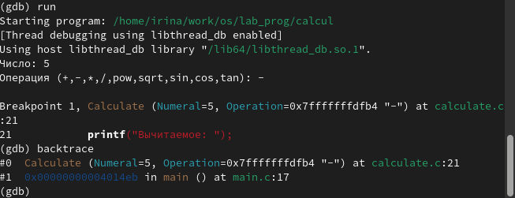{#fig:016 width=70%}

## Выполнение лабораторной работы

17. Смотрю, чему равно на этом этапе значение переменной Numeral, сравниваю с результатом вывода на экран после использования другой команды (рис. 17).

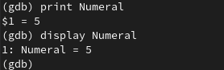{#fig:017 width=70%}

## Выполнение лабораторной работы

18. Убираю точки останова (рис. 18).

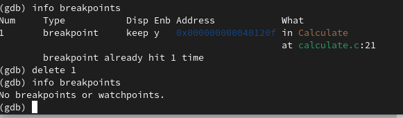{#fig:018 width=70%}

## Выполнение лабораторной работы

19. С помощью утилиты splint анализирую коды файла calculate.c (рис. 19).

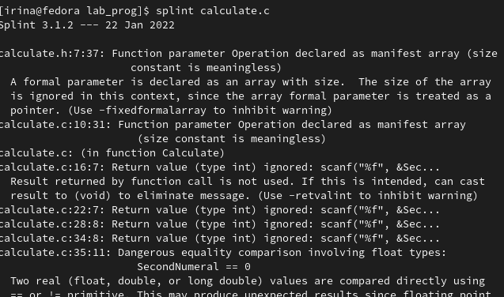{#fig:019 width=70%}

## Выполнение лабораторной работы

20. С помощью утилиты splint попробуйте анализирую коды файла main.c. (рис. 20).

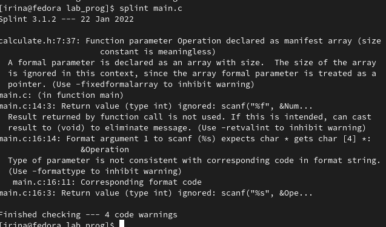{#fig:020 width=70%}

# Выводы

Я приобрела простейшие навыки разработки, анализа, тестирования и отладки приложений в ОС типа UNIX/Linux на примере создания на языке программирования С калькулятора с простейшими функциями.

