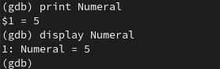

---
## Front matter
title: "Лабораторная работа №13"
subtitle: "Операционные системы"
author: "Серёгина Ирина Андреевна"

## Generic otions
lang: ru-RU
toc-title: "Содержание"

## Bibliography
bibliography: bib/cite.bib
csl: pandoc/csl/gost-r-7-0-5-2008-numeric.csl

## Pdf output format
toc: true # Table of contents
toc-depth: 2
lof: false # List of figures
lot: false # List of tables
fontsize: 12pt
linestretch: 1.5
papersize: a4
documentclass: scrreprt
## I18n polyglossia
polyglossia-lang:
  name: russian
  options:
	- spelling=modern
	- babelshorthands=true
polyglossia-otherlangs:
  name: english
## I18n babel
babel-lang: russian
babel-otherlangs: english
## Fonts
mainfont: PT Serif
romanfont: PT Serif
sansfont: PT Sans
monofont: PT Mono
mainfontoptions: Ligatures=TeX
romanfontoptions: Ligatures=TeX
sansfontoptions: Ligatures=TeX,Scale=MatchLowercase
monofontoptions: Scale=MatchLowercase,Scale=0.9
## Biblatex
biblatex: true
biblio-style: "gost-numeric"
biblatexoptions:
  - parentracker=true
  - backend=biber
  - hyperref=auto
  - language=auto
  - autolang=other*
  - citestyle=gost-numeric
## Pandoc-crossref LaTeX customization
figureTitle: "Рис."
tableTitle: "Таблица"
listingTitle: "Листинг"
lofTitle: "Список иллюстраций"
lotTitle: "Список таблиц"
lolTitle: "Листинги"
## Misc options
indent: true
header-includes:
  - \usepackage{indentfirst}
  - \usepackage{float} # keep figures where there are in the text
  - \floatplacement{figure}{H} # keep figures where there are in the text
---

# Цель работы

Приобрести простейшие навыки разработки, анализа, тестирования и отладки приложений в ОС типа UNIX/Linux на примере создания на языке программирования С калькулятора с простейшими функциями.

# Задание

1. В домашнем каталоге создайте подкаталог ~/work/os/lab_prog.
2. Создайте в нём файлы: calculate.h, calculate.c, main.c.
3. Выполните компиляцию программы посредством gcc.
4. При необходимости исправьте синтаксические ошибки.
5. Создайте Makefile.
6. С помощью gdb выполните отладку программы calcul (перед использованием gdb
исправьте Makefile).
7. С помощью утилиты splint попробуйте проанализировать коды файлов calculate.c
и main.c.

# Теоретическое введение

Стандартным средством для компиляции программ в ОС типа UNIX является GCC (GNU
Compiler Collection). Это набор компиляторов для разного рода языков программирования (С, C++, Java, Фортран и др.). Работа с GCC производится при помощи одноимённой
управляющей программы gcc, которая интерпретирует аргументы командной строки,
определяет и осуществляет запуск нужного компилятора для входного файла.
Файлы с расширением (суффиксом) .c воспринимаются gcc как программы на языке
С, файлы с расширением .cc или .C — как файлы на языке C++, а файлы c расширением
.o считаются объектными.
Во время работы над кодом программы программист неизбежно сталкивается с по-
явлением ошибок в ней. Использование отладчика для поиска и устранения ошибок
в программе существенно облегчает жизнь программиста. В комплект программ GNU
для ОС типа UNIX входит отладчик GDB (GNU Debugger).
Ещё одним средством проверки исходных кодов программ, написанных на языке C,
является утилита splint. Эта утилита анализирует программный код, проверяет коррект-
ность задания аргументов использованных в программе функций и типов возвращаемых
значений, обнаруживает синтаксические и семантические ошибки.
В отличие от компилятора C анализатор splint генерирует комментарии с описанием
разбора кода программы и осуществляет общий контроль, обнаруживая такие ошибки,
как одинаковые объекты, определённые в разных файлах, или объекты, чьи значения не
используются в работе программы, переменные с некорректно заданными значениями
и типами и многое другое.

# Выполнение лабораторной работы

1. В домашнем каталоге создаю подкаталог ~/work/os/lab_prog (рис. @fig:001).

{#fig:001 width=70%}

2. Создаю в нём файлы: calculate.h, calculate.c, main.c. (рис. @fig:002).

{#fig:002 width=70%}

3. Реализация функций калькулятора в файле calculate.h (рис. @fig:003).

{#fig:003 width=70%}

4. Интерфейсный файл calculate.h, описывающий формат вызова функции калькулятора (рис. @fig:004).

{#fig:004 width=70%}

5. Основной файл main.c, реализующий интерфейс пользователя к калькулятору (рис. @fig:005).

{#fig:005 width=70%}

6. Выполняю компиляцию программы посредством gcc (рис. @fig:006).

{#fig:006 width=70%}

7. Создаю Makefile, исправляю ошибки (рис. @fig:007).

{#fig:007 width=70%}

8. Выполняю команду make (рис. @fig:008).

{#fig:008 width=70%}

9. Запускаю отладчик GDB, загрузив в него программу для отладки (рис. @fig:009).

{#fig:009 width=70%}

10. Для запуска программы внутри отладчика ввожу команду run (рис. @fig:010).

{#fig:010 width=70%}

11. Для постраничного (по 9 строк) просмотра исходного код использую команду list (рис. @fig:011).

{#fig:011 width=70%}

12. Для просмотра строк с 12 по 15 основного файла использую команду list(рис. @fig:012).

{#fig:012 width=70%}

13. Для просмотра определённых строк не основного файла использую list с параметрами (рис. @fig:013).

{#fig:013 width=70%}

14. Устанавливаю точку останова в файле calculate.c на строке номер 21 (рис. @fig:014).

{#fig:014 width=70%}

15. Вывожу информацию об имеющихся в проекте точках останова (рис. @fig:015).

{#fig:015 width=70%}

16. Запускаю программу внутри отладчика и убеждаюсь, что программа остановится в момент прохождения точки останова (рис. @fig:016).

{#fig:016 width=70%}

17. Смотрю, чему равно на этом этапе значение переменной Numeral, сравниваю с результатом вывода на экран после использования другой команды (рис. @fig:017).

{#fig:017 width=70%}

18. Убираю точки останова (рис. @fig:018).

{#fig:018 width=70%}

19. С помощью утилиты splint анализирую коды файла calculate.c (рис. @fig:019).

{#fig:019 width=70%}

20. С помощью утилиты splint попробуйте анализирую коды файла main.c. (рис. @fig:020).

{#fig:020 width=70%}

# Выводы

Я приобрела простейшие навыки разработки, анализа, тестирования и отладки приложений в ОС типа UNIX/Linux на примере создания на языке программирования С калькулятора с простейшими функциями.

# Список литературы{.unnumbered}

::: {#refs}
:::
