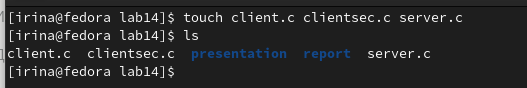
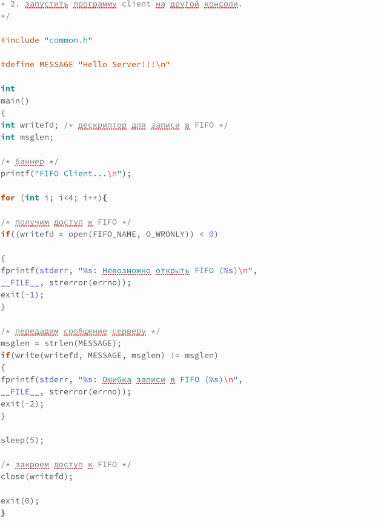
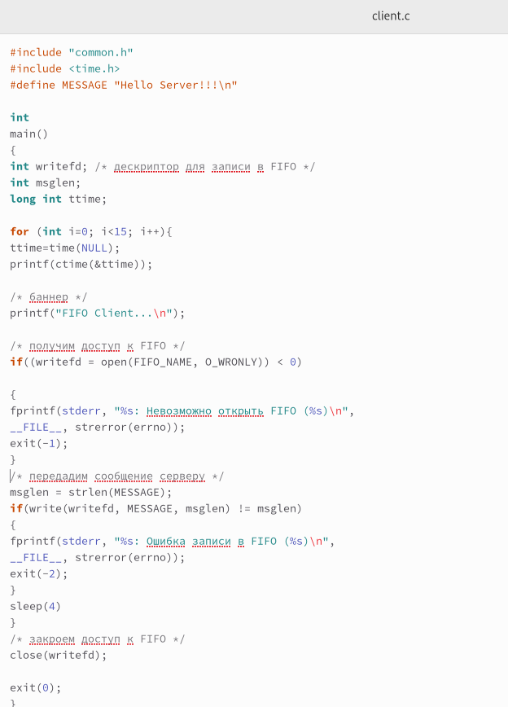
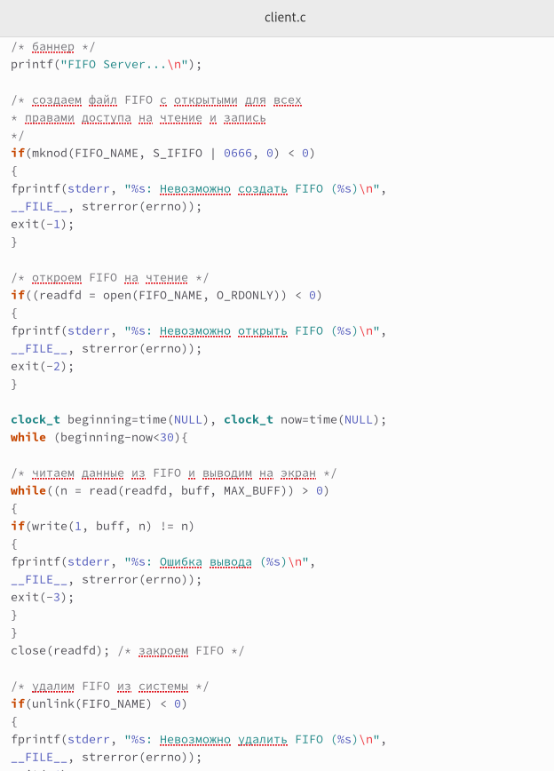
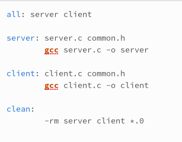

---
## Front matter
lang: ru-RU
title: Лабораторная работа №14
subtitle: Операционные системы
author:
  - Серёгина Ирина Андреевна
institute:
  - Российский университет дружбы народов, Москва, Россия
  
date: 13 мая 2023

## i18n babel
babel-lang: russian
babel-otherlangs: english

## Formatting pdf
toc: false
toc-title: Содержание
slide_level: 2
aspectratio: 169
section-titles: true
theme: metropolis
header-includes:
 - \metroset{progressbar=frametitle,sectionpage=progressbar,numbering=fraction}
 - '\makeatletter'
 - '\beamer@ignorenonframefalse'
 - '\makeatother'
---

# Цель работы

Приобретение практических навыков работы с именованными каналами.

# Задание

Изучите приведённые в тексте программы server.c и client.c. Взяв данные примеры
за образец, напишите аналогичные программы, внеся следующие изменения:
1. Работает не 1 клиент, а несколько (например, два).
2. Клиенты передают текущее время с некоторой периодичностью (например, раз в пять
секунд). Используйте функцию sleep() для приостановки работы клиента.
3. Сервер работает не бесконечно, а прекращает работу через некоторое время (например, 30 сек). Используйте функцию clock() для определения времени работы сервера.
Что будет в случае, если сервер завершит работу, не закрыв канал?

# Выполнение лабораторной работы

## Выполнение лабораторной работы

1. Я открываю терминал и создаю файлы, которые понадобятся мне при выполнении лабораторной работы (рис. 1).

{#fig:001 width=70%}

## Выполнение лабораторной работы

2. Программа 1 (рис.2).

{#fig:002 width=70%}

## Выполнение лабораторной работы

3. Программа 2 (рис. 3).

{#fig:003 width=70%}

## Выполнение лабораторной работы

4. Программа 3 (рис. 4).

{#fig:004 width=70%}

## Выполнение лабораторной работы

5. После этого я создаю Makefile и заполняю его, все компилируется удачно (рис. 5).

{#fig:005 width=70%}

# Выводы

Я приобрела практические навыки работы с именованными каналами.

