---
## Front matter
lang: ru-RU
title: Первый этап индивидуального проекта
subtitle: Операционные системы
author:
  - Серёгина Ирина Андреевна
institute:
  - Российский университет дружбы народов, Москва, Россия
  
date: 25 февраля 2023

## i18n babel
babel-lang: russian
babel-otherlangs: english

## Formatting pdf
toc: false
toc-title: Содержание
slide_level: 2
aspectratio: 169
section-titles: true
theme: metropolis
header-includes:
 - \metroset{progressbar=frametitle,sectionpage=progressbar,numbering=fraction}
 - '\makeatletter'
 - '\beamer@ignorenonframefalse'
 - '\makeatother'
---
## Цель работы

Создать необхоимые репозитории и свой сайт на hugo.

## Выполнение первого этапа проекта

Для начала я скачиваю архив с репозитория (рис. 1).

## Выполнение первого этапа проекта

В домашней папке создаю папку bin, туда перемещаю исполняемый файл hugo (рис. 2).

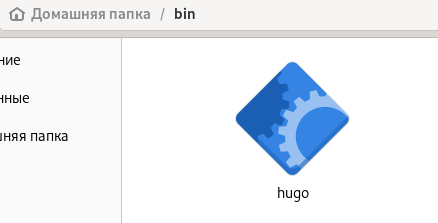

## Выполнение первого этапа проекта

По ссылке перехожу на шаблон репозитория (рис. 3).

## Выполнение первого этапа проекта

Использую этот шаблон (рис. 4).

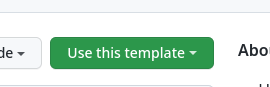

## Выполнение первого этапа проекта

Присваиваю репозиторию имя blog (рис. 5).

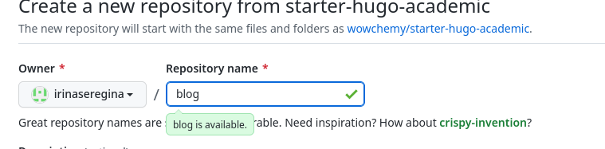

## Выполнение первого этапа проекта

Репозиторий создан (рис. 6).

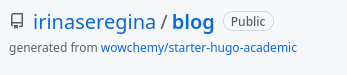

## Выполнение первого этапа проекта

Клонирую репозиторий в blog (рис. 7).

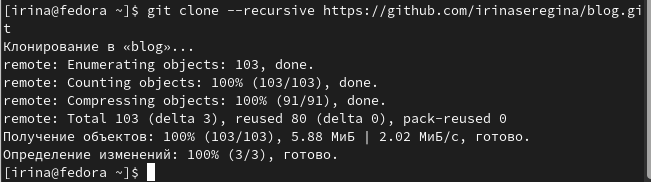

## Выполнение первого этапа проекта

Перехожу в папку blog, смотрю содержимое (рис. 8).

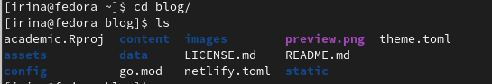

## Выполнение первого этапа проекта

Выполняю команду ~/bin/hugo (рис. 9).

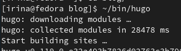

## Выполнение первого этапа проекта

Удаляю каталог public со всем его содержимым (рис. 10).

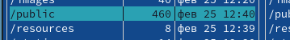

## Выполнение первого этапа проекта

Выполняю команду ~/bin/hugo server, после этого перехожу по появившейся ссылке (рис. 11).

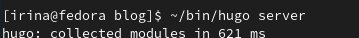

## Выполнение первого этапа проекта

Открывается шаблон сайта (рис. 12).

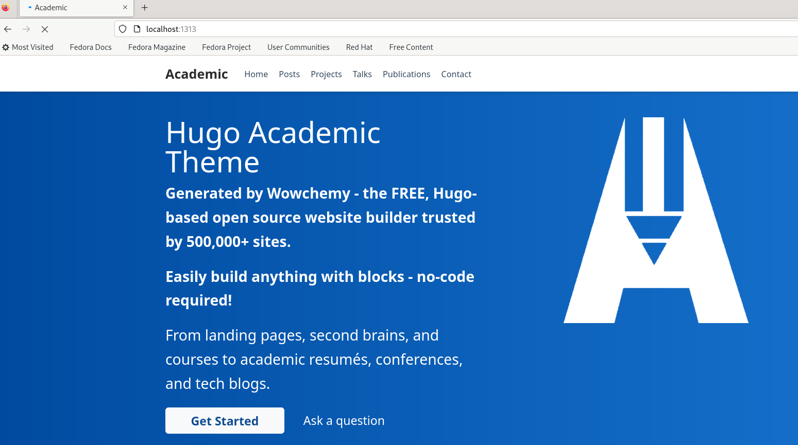

## Выполнение первого этапа проекта

Создаю новый репозиторий (рис. 13).

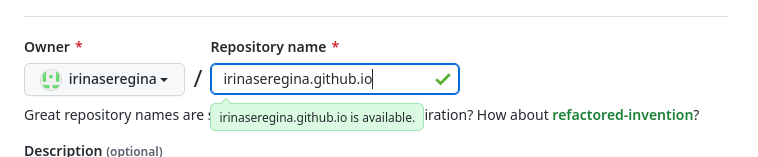

## Выполнение первого этапа проекта

Клонирую новый репозиторий в work (рис. 14).

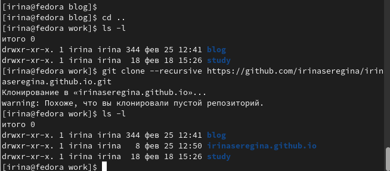

## Выполнение первого этапа проекта

Перехожу в каталог репозитория,там создаю новую ветку main (рис. 15).

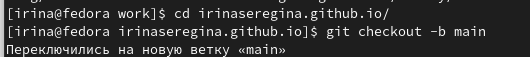

## Выполнение первого этапа проекта

Создаю пустой файл, после этого отправляю его на сервер привычным путем (рис. 16).

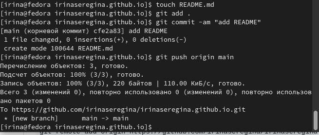

## Выполнение первого этапа проекта

Файл успешно добавлен (рис. 17).

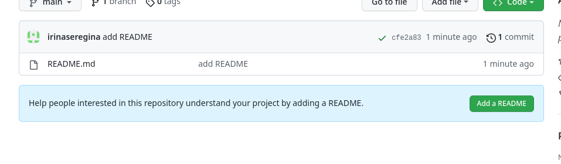

## Выполнение первого этапа проекта

Переходим обратно в blog, после этого выполняем команду, которая подключит новый репозиторий к папке public (рис. 18).

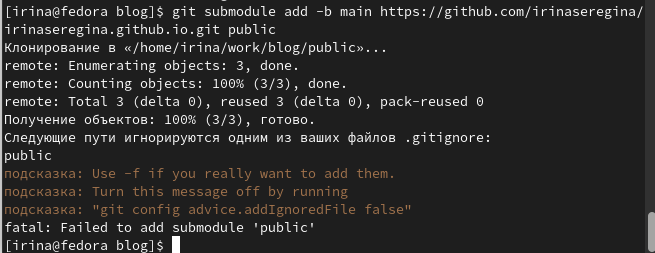

## Выполнение первого этапа проекта

Из-за того, что public ограничивается gitignore, команда не выполнилась, заходим в mc и комментим public (рис. 19).

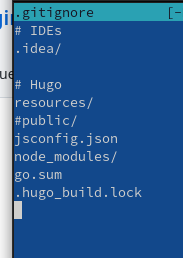

## Выполнение первого этапа проекта

Повторно выполняю команду, все работает (рис. 20).

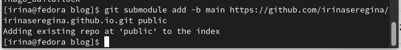

## Выполнение первого этапа проекта

Ещё раз выполняю команду ~/bin/hugo (рис. 21).

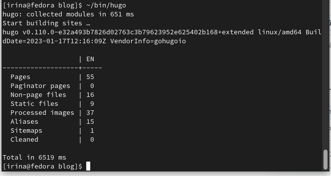

## Выполнение первого этапа проекта

Все файлы скопировались в public (рис. 22).

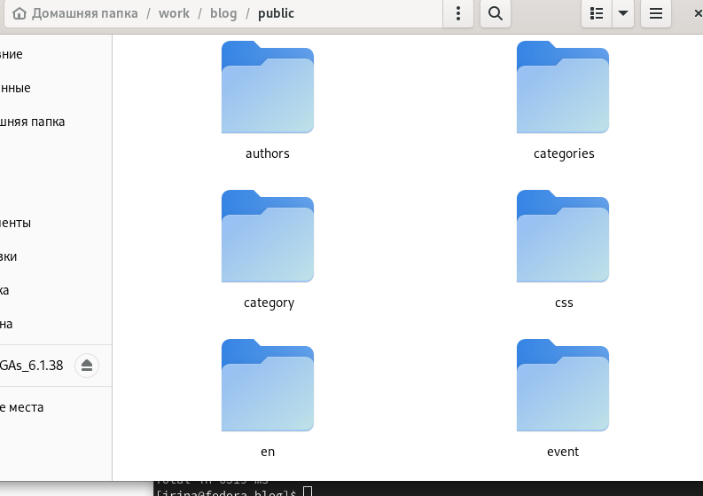

## Выполнение первого этапа проекта

Возвращаюсь в public и проверяю, подключен ли каталог к репозиторию (рис. 23).

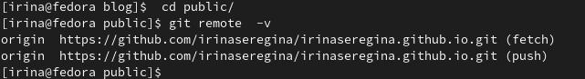

## Выполнение первого этапа проекта

После этого выполняю стандартный набор команд для добавления файлов на сервер (рис. 24).

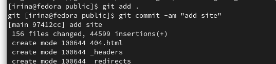

## Выполнение первого этапа проекта

Выполняю команду git push (рис. 25).

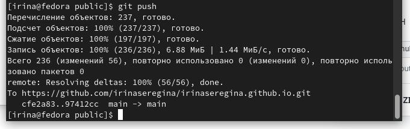

## Выполнение первого этапа проекта

Репозиторий обновился (рис. 26).

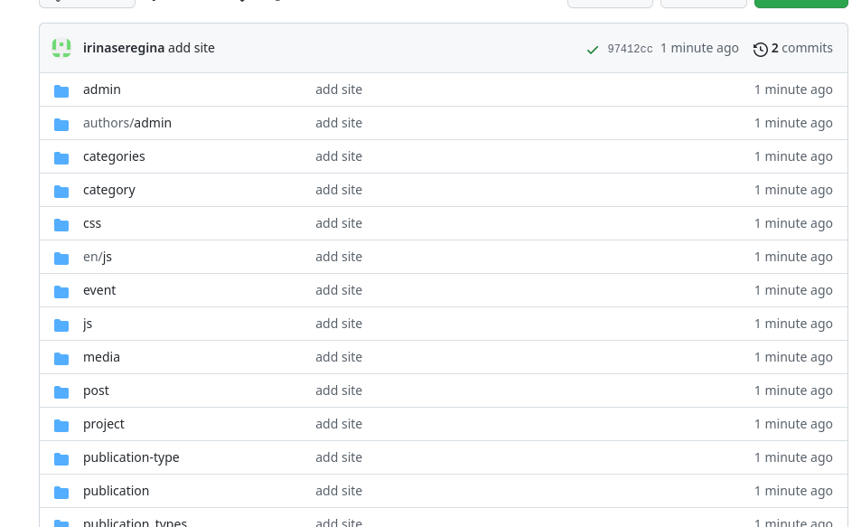

## Выполнение первого этапа проекта

После этого я копирую конец ссылки, который теперь должен открывать мой сайт (рис. 27).

## Выполнение первого этапа проекта

Сайт открывется (рис. 28).

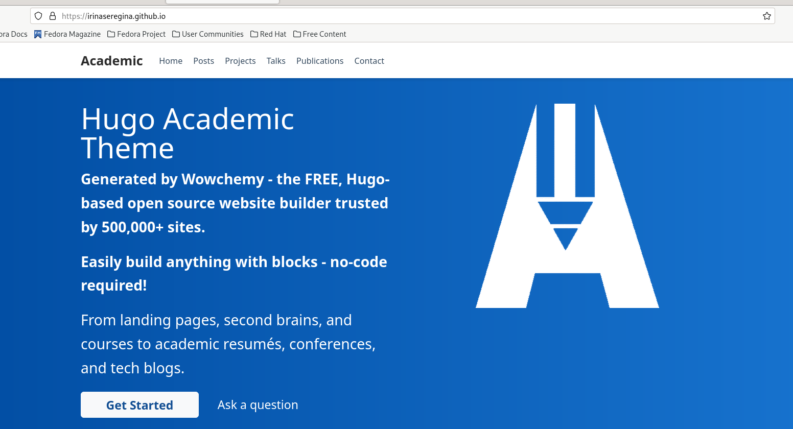

## Выводы

Я создала сайт и необходимые репозитории.

:::

