---
## Front matter
title: "Отчёт по первому этапу индивидуального проекта"
subtitle: "Операционные системы"
author: "Серёгина Ирина Андреевна"

## Generic otions
lang: ru-RU
toc-title: "Содержание"

## Bibliography
bibliography: bib/cite.bib
csl: pandoc/csl/gost-r-7-0-5-2008-numeric.csl

## Pdf output format
toc: true # Table of contents
toc-depth: 2
lof: true # List of figures
lot: true # List of tables
fontsize: 12pt
linestretch: 1.5
papersize: a4
documentclass: scrreprt
## I18n polyglossia
polyglossia-lang:
  name: russian
  options:
	- spelling=modern
	- babelshorthands=true
polyglossia-otherlangs:
  name: english
## I18n babel
babel-lang: russian
babel-otherlangs: english
## Fonts
mainfont: PT Serif
romanfont: PT Serif
sansfont: PT Sans
monofont: PT Mono
mainfontoptions: Ligatures=TeX
romanfontoptions: Ligatures=TeX
sansfontoptions: Ligatures=TeX,Scale=MatchLowercase
monofontoptions: Scale=MatchLowercase,Scale=0.9
## Biblatex
biblatex: true
biblio-style: "gost-numeric"
biblatexoptions:
  - parentracker=true
  - backend=biber
  - hyperref=auto
  - language=auto
  - autolang=other*
  - citestyle=gost-numeric
## Pandoc-crossref LaTeX customization
figureTitle: "Рис."
tableTitle: "Таблица"
listingTitle: "Листинг"
lofTitle: "Список иллюстраций"
lotTitle: "Список таблиц"
lolTitle: "Листинги"
## Misc options
indent: true
header-includes:
  - \usepackage{indentfirst}
  - \usepackage{float} # keep figures where there are in the text
  - \floatplacement{figure}{H} # keep figures where there are in the text
---

# Цель работы

Создать необхоимые репозитории и свой сайт на hugo.

# Выполнение первого этапа проекта

Для начала я скачиваю архив с репозитория (рис. @fig:001).

{#fig:001 width=70%}

В домашней папке создаю папку bin, туда перемещаю исполняемый файл hugo (рис. @fig:002).

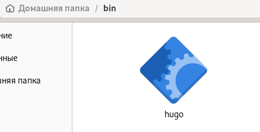{#fig:002 width=70%}

По ссылке перехожу на шаблон репозитория (рис. @fig:003).

{#fig:003 width=70%}

Использую этот шаблон (рис. @fig:004).

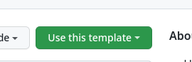{#fig:004 width=70%}

Присваиваю репозиторию имя blog (рис. @fig:005).

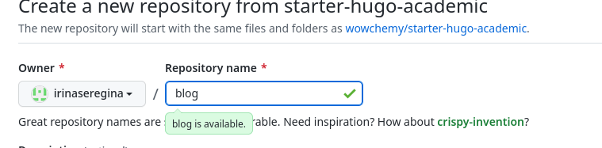{#fig:005 width=70%}

Репозиторий создан (рис. @fig:006).

{#fig:006 width=70%}

Клонирую репозиторий в blog (рис. @fig:007).

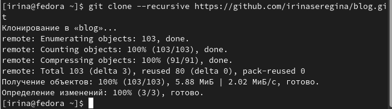{#fig:007 width=70%}

Перехожу в папку blog, смотрю содержимое (рис. @fig:008).

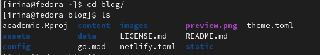{#fig:008 width=70%}

Выполняю команду ~/bin/hugo (рис. @fig:009).

{#fig:009 width=70%}

Удаляю каталог public со всем его содержимым (рис. @fig:010).

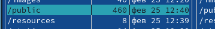{#fig:010 width=70%}

Выполняю команду ~/bin/hugo server, после этого перехожу по появившейся ссылке (рис. @fig:011).

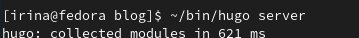{#fig:011 width=70%}

Открывается шаблон сайта (рис. @fig:012).

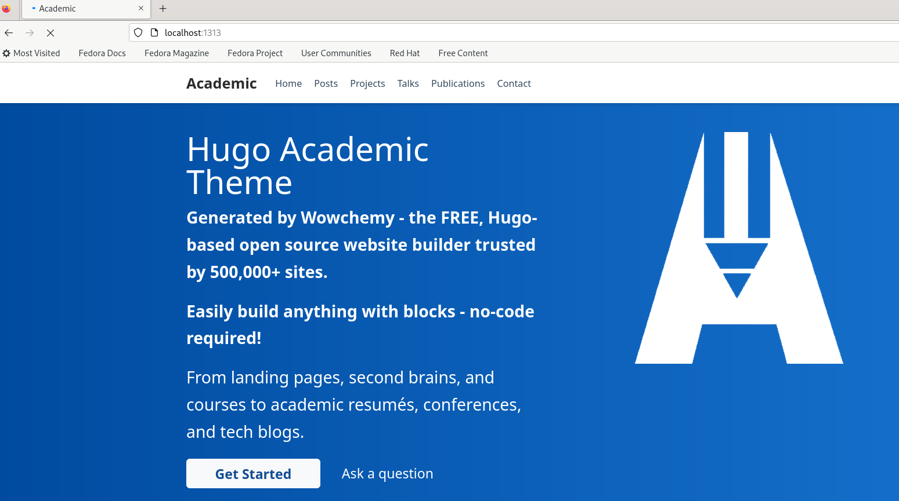{#fig:012 width=70%}

Создаю новый репозиторий (рис. @fig:013).

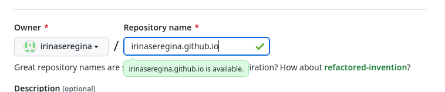{#fig:013 width=70%}

Клонирую новый репозиторий в work (рис. @fig:014).

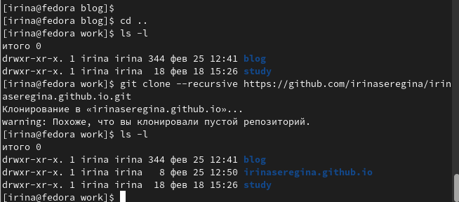{#fig:014 width=70%}

Перехожу в каталог репозитория,там создаю новую ветку main (рис. @fig:015).

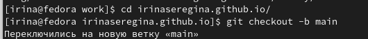{#fig:015 width=70%}

Создаю пустой файл, после этого отправляю его на сервер привычным путем (рис. @fig:016).

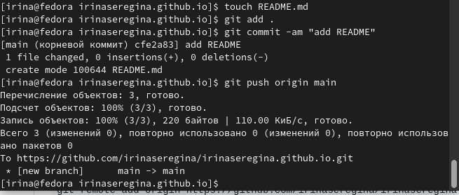{#fig:016 width=70%}

Файл успешно добавлен (рис. @fig:017).

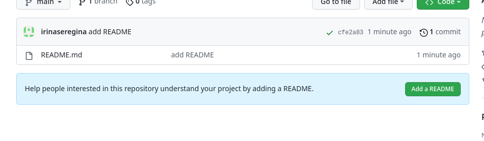{#fig:017 width=70%}

Переходим обратно в blog, после этого выполняем команду, которая подключит новый репозиторий к папке public (рис. @fig:018).

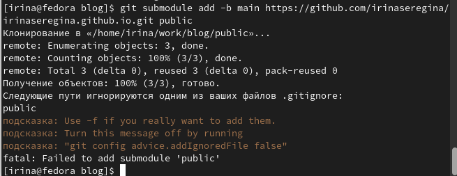{#fig:018 width=70%}

Из-за того, что public ограничивается gitignore, команда не выполнилась, заходим в mc и комментим public (рис. @fig:019).

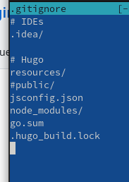{#fig:019 width=70%}

Повторно выполняю команду, все работает (рис. @fig:020).

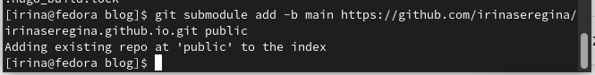{#fig:020 width=70%}

Ещё раз выполняю команду ~/bin/hugo (рис. @fig:021).

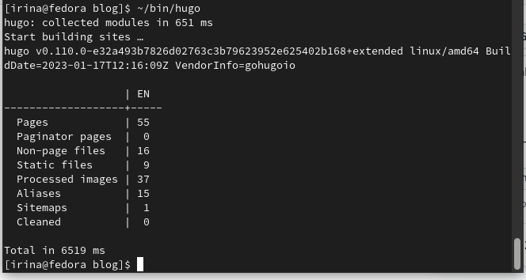{#fig:021 width=70%}

Все файлы скопировались в public (рис. @fig:022).

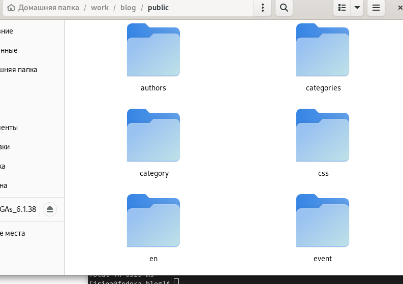{#fig:022 width=70%}

Возвращаюсь в public и проверяю, подключен ли каталог к репозиторию (рис. @fig:023).

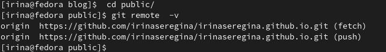{#fig:023 width=70%}

После этого выполняю стандартный набор команд для добавления файлов на сервер (рис. @fig:024).

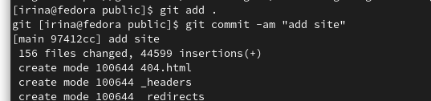{#fig:024 width=70%}

Выполняю команду git push (рис. @fig:025).

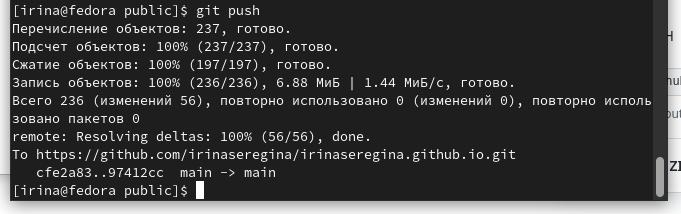{#fig:025 width=70%}

Репозиторий обновился (рис. @fig:026).

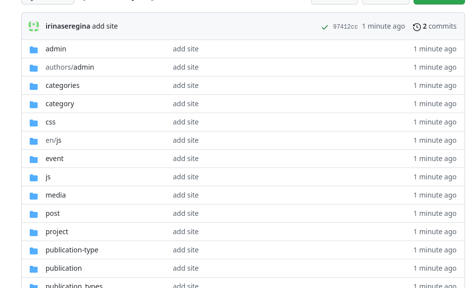{#fig:026 width=70%}

После этого я копирую конец ссылки, который теперь должен открывать мой сайт (рис. @fig:027).

{#fig:027 width=70%}

Сайт открывется (рис. @fig:028).

{#fig:028 width=70%}

# Выводы

Я создала сайт и необходимые репозитории.

# Список литературы{.unnumbered}

::: {#refs}
:::
