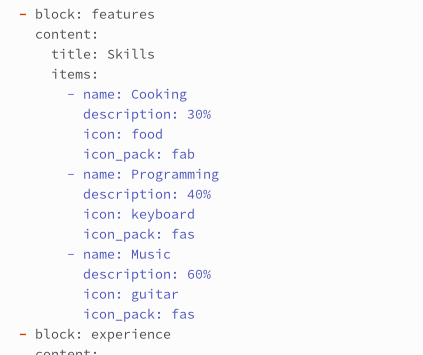
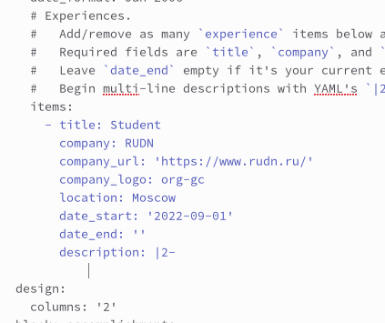
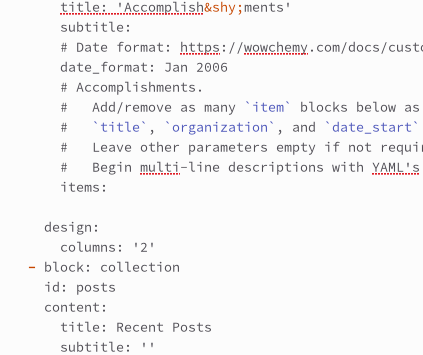
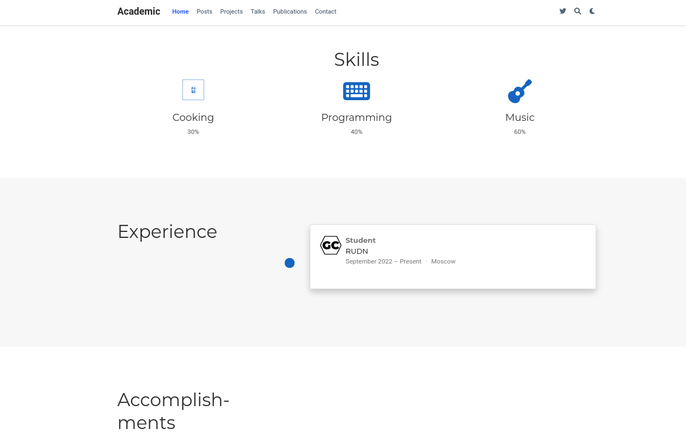
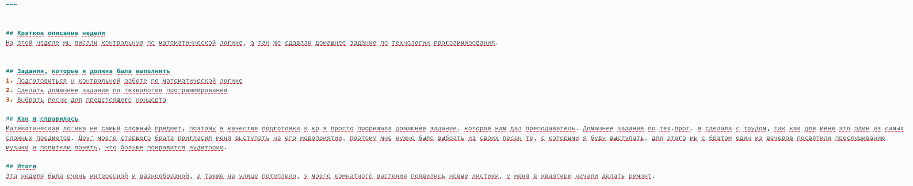
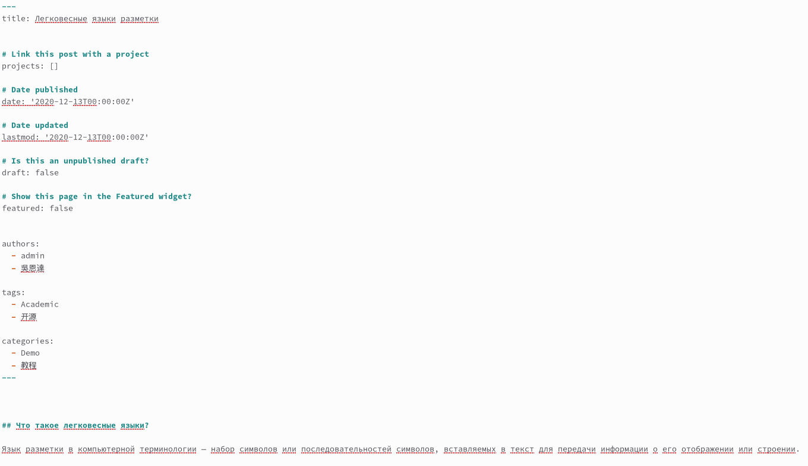
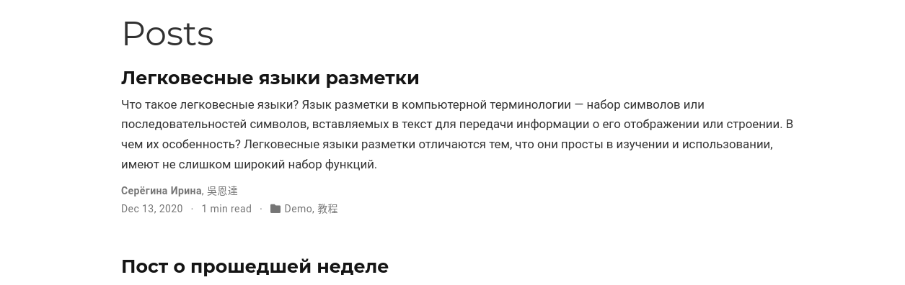

---
## Front matter
lang: ru-RU
title: Третий этап индивидуального проекта
subtitle: Операционные системы
author:
  - Серёгина Ирина Андреевна
institute:
  - Российский университет дружбы народов, Москва, Россия
  
date: 06 апреля 2023

## i18n babel
babel-lang: russian
babel-otherlangs: english

## Formatting pdf
toc: false
toc-title: Содержание
slide_level: 2
aspectratio: 169
section-titles: true
theme: metropolis
header-includes:
 - \metroset{progressbar=frametitle,sectionpage=progressbar,numbering=fraction}
 - '\makeatletter'
 - '\beamer@ignorenonframefalse'
 - '\makeatother'
---

# Цель работы

Продолжить редактирование сайта, добавить ещё больше информации о себе.

# Задание

1. Добавить информацию о навыках
2. Добавить информацию об опыте
3. Добавить информацию о достижениях
4. Добавить пост о прошедшей неделе
5. Добавить пост о легковесных языках разметки

# Выполнение лабораторной работы

## Выполнение лабораторной работы

1. Изменяю информацию о своих навыках (рис. 1).

{#fig:001 width=70%}

## Выполнение лабораторной работы

2. Изменяю информацию о своем опыте (рис. 2).

{#fig:002 width=70%}

## Выполнение лабораторной работы

3. Удаляю информацию о достижениях (рис. 3).

{#fig:003 width=70%}

## Выполнение лабораторной работы

4. Так изменения выглядят на сайте (рис. 4).

{#fig:004 width=70%}

## Выполнение лабораторной работы

5. Пишу пост о прошедшей неделе (рис. 5).

{#fig:005 width=70%}

## Выполнение лабораторной работы

6. Пишу пост о легковесных языках разметки (рис. 6).

{#fig:006 width=70%}

## Выполнение лабораторной работы

7. Посты добавились на сайт (рис. 7).

{#fig:007 width=70%}

# Выводы

Я отредактировала сайт, добавила всю необходимую информацию. 
